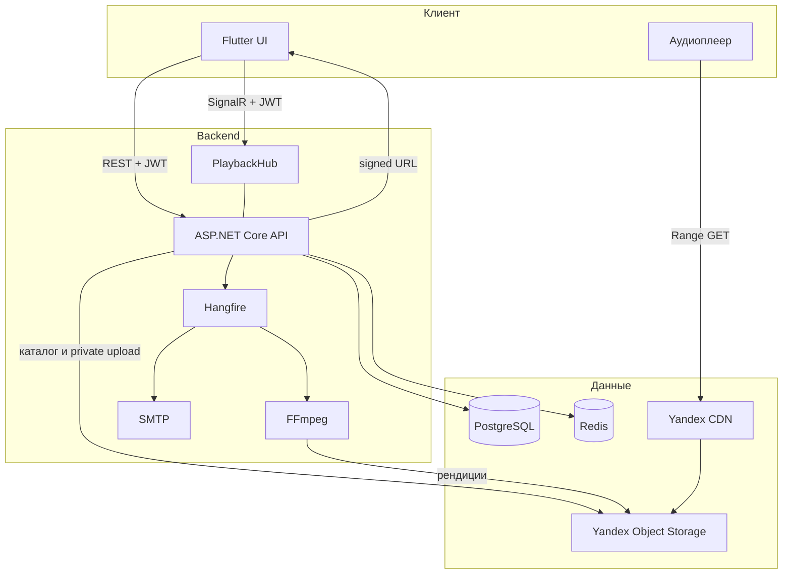

# Music Anti Blur — описание продукта и план

Версия: 0.3  
Клиенты MVP: только мобильное приложение (Flutter)  
Дизайн: отсутствует, разрабатывается отдельно; в спринтах UI не полируем

---

## 1. Что строим

Стриминг музыки с каталогом на сервере и отличительной функцией: пользователь может **подменить каталожный трек своим локальным файлом** и явно выбрать источник воспроизведения (стрим каталога, локальный файл или **свою приватную копию на сервере**).

Это не клон Spotify. Каталог, плеер и персональная библиотека на устройстве живут в одной очереди.

Рабочая формулировка для команды: *«Плеер, в котором можно заменить трек каталога своей копией и при желании синхронизировать её между устройствами»*.

---

## 2. Стек MVP

| Слой | Технология | Роль |
|---|---|---|
| Мобильный клиент | Flutter (iOS + Android) | Единственный клиент MVP |
| API | ASP.NET Core (C#) | HTTP API, SignalR hub, Hangfire server |
| ORM | Entity Framework Core | Модель, миграции |
| БД | PostgreSQL | Пользователи, каталог, overrides, приватные рендиции, Hangfire storage |
| Кэш / backplane | Redis | Кэш, rate limit логина и reset, SignalR scale-out |
| Объектное хранилище | Yandex Object Storage (S3 API) | Каталог, приватные загрузки пользователей, транскод |
| Отдача аудио | Yandex CDN | Range-запросы, разгрузка API |
| Транскодинг | FFmpeg | Несколько качеств каталожного и приватного трека |
| Очередь задач | Hangfire | Транскодинг, письма восстановления пароля, уборка |
| Realtime | SignalR | Состояние воспроизведения, присутствие устройств, «транскод готов» |
| Почта | SMTP (локально MailHog / smtp4dev) | Письма восстановления пароля |

**Не используем в MVP:** Blazor, микросервисы, Kubernetes, отдельный ML-сервис, HLS/DASH (один файл на качество, progressive download + Range), рекомендации.

### 2.1. Как связаны компоненты



Правило: **API не стримит аудиобайты**. API отдаёт метаданные и короткоживущий signed URL на CDN. Плеер качает файл напрямую. Для приватной копии URL выдаётся **только владельцу**.

Hangfire в MVP крутится **в процессе API** (один деплой). FFmpeg вызывается из Hangfire-джобы. Если CPU станет узким — вынести worker отдельно, контракт джоб не менять.

### 2.2. Почему стек такой (коротко)

- Flutter — фон, lock screen, Bluetooth, доступ к файлам для подмены.
- ASP.NET + EF + PostgreSQL — каталог, пользователи, миграции, транзакции.
- Redis нужен сразу: логин и reset без брутфорса, SignalR на нескольких инстансах, кэш signed URL.
- FFmpeg + Hangfire — выбор качества не сделать «на лету» из одного файла без предрасчёта; тот же пайплайн для приватных загрузок.
- Yandex Object Storage + CDN — аудитория РФ/СНГ, S3-совместимость, трафик не через Kestrel.
- SignalR — несколько устройств одного пользователя и пуш «транскод готов» (каталог и private).
- SMTP — восстановление пароля по email в MVP.

---

## 3. Ограничения для разработчиков

1. **Дизайна нет.** Flutter: Material 3 из коробки, стандартные `AppBar` / `ListTile` / `Slider`. Никаких кастомных тем, иллюстраций, анимаций «для красоты». Имена экранов и поля держать стабильными — дизайнер наложит UI позже.
2. **Один клиент.** Веб не делаем, даже «на час». Контракт API проектировать так, чтобы веб мог подключиться post-MVP.
3. **Нет плейлистов и избранного** в MVP. Очередь воспроизведения — эфемерная, только на устройстве (плюс синхронизация через SignalR, если устройство онлайн).
4. **Нет рекомендаций** в MVP. Не собирать под них отдельный сервис, экраны «для вас» и джобы пересчёта.
5. Приватный файл пользователя не попадает в каталог, поиск и выдачу другим аккаунтам.
6. Не тащить в спринт пункты из раздела «Вне MVP / out of scope».

---

## 4. Функциональные требования MVP

### 4.1. Аккаунт

**Регистрация.** Пользователь **явно выбирает**, чем регистрироваться: **email** или **логин** (radio / сегмент), не оба сразу и не автоопределение по символу `@`. Поля: выбранный идентификатор + пароль.

- `identifierType`: `email` | `login`
- В БД заполняется только выбранное поле, второе — `NULL`.
- Email хранить normalized lowercase, уникальный среди не-null.
- Login: `[a-zA-Z0-9_.-]{3,32}`, уникальный среди не-null.
- CHECK: задан ровно один из `Email` / `Login`.

**Вход.** Тоже явный выбор типа: «войти по email» или «войти по логину». Тело запроса: `{ identifierType, identifier, password }`. Сервер **не** угадывает тип по `@`.

**Пароль** хранится только как хеш (ASP.NET Identity hasher или аналог). Никогда в открытом виде.

**Сессия:** JWT access + refresh, refresh в БД (можно отозвать). Выход, выход со всех устройств. Смена пароля залогиненным.

**Восстановление пароля по email (MVP):**

1. Экран «забыл пароль»: пользователь вводит email.
2. `POST /api/auth/forgot-password` всегда отвечает одинаково (200), чтобы не раскрывать, есть ли аккаунт.
3. Если пользователь с таким email есть — Hangfire/SMTP шлёт письмо со ссылкой или кодом (TTL, одноразовый токен в БД).
4. Экран смены пароля по токену: `POST /api/auth/reset-password`.
5. Rate limit на forgot-password (Redis).
6. Аккаунт, зарегистрированный **только по логину**, восстановить по почте нельзя, пока не привязан email. В профиле MVP: **привязать email** (уникальный) — после этого recovery работает. Привязать логин к email-аккаунту — симметрично, тоже MVP (чтобы вход «по логину» был доступен тем, кто пришёл с почты).

Вне MVP: вход через Яндекс (OAuth).

Локально: MailHog / smtp4dev в docker-compose, письма не уходят в интернет.

### 4.2. Каталог

- Сущности: исполнитель, альбом, трек.
- У трека несколько **рендиций** (качеств), см. 4.4.
- Поиск по названию трека, альбома, исполнителя (ILIKE / простой full text). **Приватные загрузки в поиск не попадают.**
- Экраны: поиск, список исполнителей/альбомов, карточка альбома, карточка трека.
- Импорт каталога на старте: админ-эндпоинт или seed + загрузка файла. Полноценный кабинет артиста не делаем.

### 4.3. Воспроизведение

- Проиграть трек / альбом.
- Очередь: текущий трек, следующие, предыдущие; next/prev; seek.
- Repeat off / one / all, shuffle — для текущей эфемерной очереди.
- Фон, наушники, lock screen / notification media controls.
- Сохранение позиции трека (progress) на сервере — чтобы продолжить на другом устройстве.
- Выбор качества (4.4).
- Подмена локальным файлом и опциональная приватная загрузка (4.5).

### 4.4. Выбор качества

Качества **не произвольные**: задаются профилями транскодинга на бэкенде.

Стартовый набор профилей (можно сузить при реализации, нельзя расширять «на глаз» в клиенте):

| Код | Контейнер / кодек | Битрейт | Назначение |
|---|---|---|---|
| `aac_128` | m4a / AAC | 128 kbps | экономия трафика |
| `aac_256` | m4a / AAC | 256 kbps | дефолт |
| `src` | как загружено | исходник | если исходник уже пригоден, иначе после транскода может не отдаваться |

Минимально для приёмки: **хотя бы два** доступных качества у тестового **каталожного** трека. Для приватной копии — те же профили, когда загрузка завершена.

Поведение:

- У трека список `availableQualities` (только готовые рендиции источника, статус `Ready`).
- Пользователь выбирает: конкретный профиль **или** `auto` (в MVP auto = максимальный Ready).
- Выбор качества — настройка пользователя + возможность переключить на текущем треке.
- Если выбранного качества нет (ещё транскодируется) — fallback на ближайшее более низкое Ready, иначе ошибка с понятным текстом.
- Плеер запрашивает signed URL **конкретной** рендиции выбранного источника (каталог или private).

Исходный файл после загрузки кладётся в бакет; Hangfire режет профили через FFmpeg.

### 4.5. Подмена трека: локальный файл и приватная копия на сервере

Для записи каталога пользователь может:

1. Привязать локальный аудиофайл.
2. **По желанию загрузить этот файл на сервер** (приватная копия).
3. Выбрать источник: **Catalog** | **Local** | **Private** (серверная копия).
4. Видеть в плеере и очереди, какой источник играет.
5. Переключить источник без выброса из очереди.

Зачем загрузка: синхронизация между устройствами; доступ к «своей» версии после удаления файла с телефона.

Правила привязки и локального файла:

- Привязка персональная, per-user, не меняет каталог для других.
- Глобальный дефолт: «если локальный файл доступен — играть его; иначе если есть Ready private — его; иначе каталог». Плюс явное переопределение на трек.
- Локальный файл недоступен (нет permission, удалили):
  - есть private Ready → играть private, можно показать баннер «локальный файл недоступен, играет копия на сервере»;
  - private нет → тост/баннер + каталог, не тихий skip.
- Длительности расходятся сильно (порог, например 5%) — предупредить при привязке, не блокировать.
- На мобиле хранить SAF URI / security-scoped bookmark, не голый path.

Правила приватной загрузки:

- Загрузка **опциональна**, отдельное действие («загрузить на сервер»), не скрытый побочный эффект picker’а.
- Объект в бакете с ключом вида `users/{userId}/overrides/{trackId}/...`. Не класть в каталожный префикс `tracks/{trackId}/`.
- Транскод теми же профилями, статусы Pending / Processing / Ready / Failed.
- Signed URL и метаданные рендиций — только для `userId` владельца. Чужой пользователь: 404 (не 403), чтобы не палить существование.
- **Другие пользователи не видят, не ищут, не стримят, не получают в SignalR чужой private-трек.** Каталожная карточка для них без этой подмены.
- Админ-каталог и публичные списки private не включают. Ключи в логах Hangfire не должны светить URL с подписью.
- Лимит MVP: один исходник на пару (user, track); ограничить размер файла (зафиксировать в коде, например 100 МБ).
- Удаление private-копии владельцем: объекты в бакете + строки рендиций. Локальная привязка может остаться.
- Второе устройство того же аккаунта играет Private по signed URL, даже если локального файла там нет.

Автоскан папки и fingerprint — вне MVP (ручная привязка).

### 4.6. SignalR в MVP

Hub: состояние воспроизведения пользователя.

- События: now playing, pause/play, seek, смена качества, смена источника (`catalog` / `local` / `private`), прогресс, эфемерная очередь.
- Присутствие устройств.
- Пуш: рендиция стала `Ready` (каталог для admin/карточки; private — только владельцу).
- Авторизация JWT на хабе.
- Backplane: Redis (даже на одном инстансе — чтобы не переделывать).

Конфликт двух устройств, которые оба жмут play: last-write-wins по timestamp сервера.

Источник `local` на другом устройстве без файла: если есть private — играть private; иначе каталог + пометка в UI.

### 4.7. Админ / оператор (минимально)

- Загрузка исходника **каталожного** трека (роль admin).
- Статус транскодинга (очередь Hangfire + поля рендиций).
- Hangfire Dashboard за admin-auth, не в публичном интернете без защиты.

Роль admin можно выдать сидом в БД. Админка не является способом послушать чужие private-файлы.

---

## 5. Вне MVP и out of scope

Не брать в текущие спринты, пока MVP не принят и пункт явно не включён в план.

### 5.1. Следующий этап продукта (бэклог)

1. **Вход через Яндекс (OAuth)**  
   Связка с существующим аккаунтом по email, если совпал.

2. **Импорт библиотеки из других приложений**  
   Spotify / Яндекс Музыка / Apple Music и т.д. В MVP не писать коннекторы. Поле `Isrc` у трека можно завести пустым.

3. **Плейлисты и плейлист «Избранное»**  
   Пользовательские плейлисты, liked tracks. Сейчас очередь только эфемерная.

4. **Браузерный клиент**  
   Ранее рассматривался Blazor WASM. Решение по фреймворку — при старте этапа. Паритет локальной подмены в браузере хуже, чем на мобиле.

5. **Рекомендации**  
   Не входят в MVP. Когда дойдут: сначала события `ListenEvent`, затем popular / similar / простая персонализация; `pgvector` не блокер. Не начинать с нейросети по аудио и отдельного reco-сервиса. Рекомендовать только каталог, не чужие и не «голые» local-файлы вне `TrackId`. Черновик работ — файл спринта вне календаря MVP.

### 5.2. Out of scope

Пока явно не попросим — не проектировать и не делать «заодно»:

- автосопоставление локальных файлов по fingerprint (Chromaprint / AcoustID) и скан папки;
- HLS / адаптивный битрейт;
- кабинет артиста, модерация каталога;
- синхронизация очереди как отдельный продукт (сейчас SignalR — технический слой now playing);
- ListenEvent и аналитика прослушиваний (нужны рекомендациям, не MVP);
- нейросеть по сырому аудио, отдельный ML-сервис, A/B reco;
- восстановление пароля не по email (SMS, секретный вопрос);
- публичная / расшаренная библиотека пользовательских файлов.

---

## 6. Модель данных (эскиз)

Имена таблиц можно уточнить в спринте 1, смысл полей — нет.

**User** — Login nullable, Email nullable, PasswordHash, Role, CreatedAt  
Ограничение: ровно одно из Login/Email при регистрации; позже второе можно привязать.

**RefreshToken** — UserId, TokenHash, ExpiresAt, RevokedAt, DeviceId  

**PasswordResetToken** — UserId, TokenHash, ExpiresAt, UsedAt  

**Artist / Album / Track** — каталог; у Track опционально Isrc  

**TrackRendition** — TrackId, ProfileCode, Status (Pending/Processing/Ready/Failed), BucketKey, ContentType, BitrateKbps, SizeBytes, DurationMs  
Только каталог.

**UserSettings** — PreferredQuality (auto | profile code), PreferLocalIfAvailable  

**UserTrackOverride** — UserId, TrackId, PreferredSource (Catalog | Local | Private), DisplayName, DurationMs, SizeBytes, HasServerCopy, UploadStatus, UpdatedAt  

**UserPrivateRendition** — UserId, TrackId, ProfileCode, Status, BucketKey, …  
Доступ только по паре (UserId владельца, TrackId).

**PlaybackState** — UserId, TrackId, PositionMs, IsPlaying, QueueJson, QualityCode, Source, UpdatedAt  

Hangfire создаёт свои таблицы в PostgreSQL (схема `hangfire`).

`ListenEvent` в MVP **не создаём** (вне MVP вместе с рекомендациями).

---

## 7. Нефункциональное

- HTTPS.
- Секреты (JWT signing key, S3 keys, Redis, SMTP) только в env / user-secrets, не в репозитории.
- Бакет приватный. Публичных вечных URL на треки нет.
- Signed URL TTL короткий (минуты, не дни).
- Private-ключи неотличимы от «нет объекта» для чужого userId (404).
- Rate limit на `/auth/login` и `/auth/forgot-password` через Redis.
- Логи без паролей, без тел писем с токенами, без полных URL с подписью.
- Миграции EF — единственный способ менять схему.
- Время в UTC.

---

## 8. Риски

| Риск | Как снимаем |
|---|---|
| iOS bookmark на локальный файл протухает | хранить bookmark; UI «выбрать файл снова»; fallback на private/каталог |
| CDN + private bucket + Range | прототип одного трека в спринте хранилища, до плеера |
| FFmpeg в процессе API ест CPU | лимит параллельных джоб Hangfire (WorkerCount) |
| Утечка private-файла в каталог/поиск | отдельный префикс ключей, отдельные таблицы, тесты на 404 чужому user |
| Два устройства и только local | private-копия для синка; иначе каталог |
| Нет дизайна → бесконечный пиксель-пуш | DoD спринтов: функция, не внешний вид |
| Пустой каталог | seed из 2–3 альбомов для демо |
| SMTP на проде | в MVP достаточно рабочего SMTP; локально MailHog |
| Login-only аккаунт без почты | recovery недоступен, пока не привязан email; это ожидаемо |

---

## 9. Критерии готовности MVP (продукт)

- Регистрация с **явным** выбором email **или** логина; вход с явным выбором типа.
- Восстановление пароля по email работает на аккаунте с почтой (письмо видно в MailHog / SMTP).
- Каталог открывается, поиск находит seed-треки и **не** находит чужие private-файлы.
- Трек играет с CDN, в фоне, с lock screen.
- Можно выбрать качество из готовых рендиций.
- Можно привязать локальный файл и переключить источник Catalog / Local.
- Можно загрузить подмену на сервер; второе устройство играет private; после удаления локального файла private остаётся доступен владельцу; второй пользователь файл не видит и не стримит.
- Второе устройство видит now playing через SignalR.
- Нет экранов рекомендаций, плейлистов, OAuth, веба.
- UI допускается «серый Material», если всё выше работает.

---

## 10. Репозиторий (ожидаемая раскладка)

Предложение, фиксируется в спринте 1:

```
src/api/          ASP.NET Core
src/mobile/       Flutter
docker-compose.yml  PostgreSQL + Redis + MailHog (+ опционально api)
docs/             позже, не в no_commit
```

Инструкции по локальному запуску — `README` в корне репо (уже в git), когда появится код.
