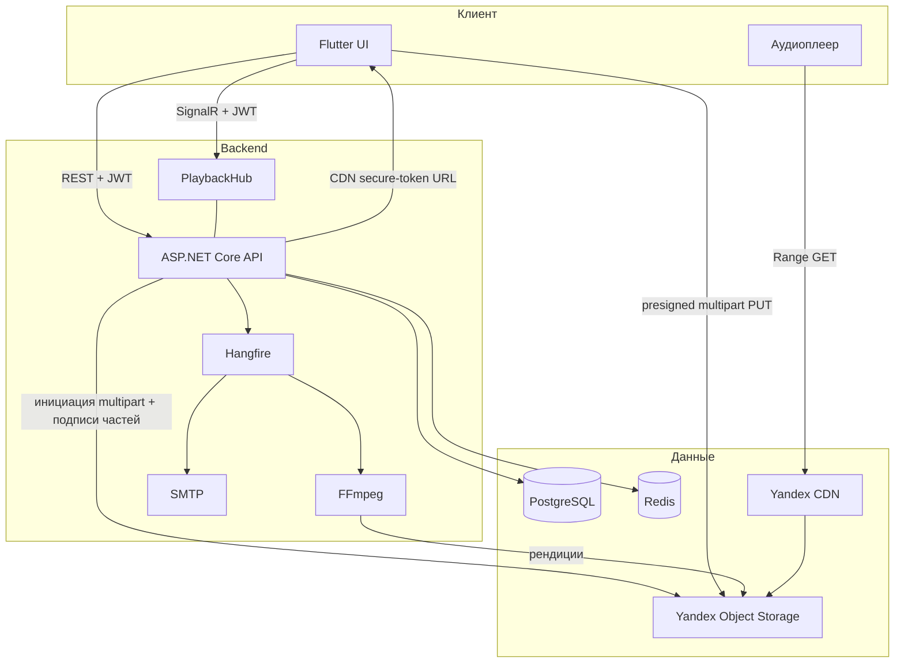

# Music Anti Blur — описание продукта и план

Версия: 0.5
Клиенты MVP: только мобильное приложение (Flutter)  
Дизайн: отсутствует, разрабатывается отдельно; в спринтах UI не полируем

Связанные документы: [00-ai-agents.md](00-ai-agents.md), [02-database-overview.md](02-database-overview.md), [03-api-contract.md](03-api-contract.md), [04-operations.md](04-operations.md), [05-local-setup.md](05-local-setup.md).

---

## 1. Что строим

Стриминг музыки с каталогом на сервере и отличительной функцией: пользователь может **подменить каталожный трек своим локальным файлом** и явно выбрать источник воспроизведения (стрим каталога, локальный файл или **свою приватную копию на сервере**).

Это не клон Spotify. Каталог, плеер и персональная библиотека на устройстве живут в одной очереди.

Рабочая формулировка для команды: *«Плеер, в котором можно заменить трек каталога своей копией и при желании синхронизировать её между устройствами»*.

---

## 2. Стек MVP

| Слой | Технология | Роль |
|---|---|---|
| Мобильный клиент | Flutter (iOS + Android) | Единственный клиент MVP |
| API | ASP.NET Core (C#) | HTTP API, SignalR hub, Hangfire server |
| ORM | Entity Framework Core | Модель, миграции |
| БД | PostgreSQL | Пользователи, каталог, overrides, приватные рендиции, Hangfire storage |
| Кэш / backplane | Redis | Кэш, rate limit логина и reset, SignalR scale-out |
| Объектное хранилище | Yandex Object Storage (S3 API) | Каталог, приватные загрузки пользователей, транскод |
| Отдача аудио | Yandex CDN | Range-запросы, разгрузка API |
| Транскодинг | FFmpeg | Несколько качеств каталожного и приватного трека |
| Очередь задач | Hangfire | Транскодинг, письма восстановления пароля, уборка |
| Realtime | SignalR | Состояние воспроизведения, присутствие устройств, «транскод готов» |
| Почта | SMTP (локально MailHog / smtp4dev) | Verification и восстановление пароля |

**Не используем в MVP:** Blazor, микросервисы, Kubernetes, отдельный ML-сервис, HLS/DASH (один файл на качество, progressive download + Range), рекомендации.

### 2.1. Как связаны компоненты



Локально (`Storage__UseCdn=false`, MinIO): Range GET идёт на S3 presigned URL, не на Yandex CDN. JSON `playback-url` тот же, поле `delivery` остаётся `cdn` (ветка remote HTTP). Норматив URL — [03-api-contract.md](03-api-contract.md) §4, локальный стек — [05-local-setup.md](05-local-setup.md).

Правило: **API не принимает и не стримит аудиобайты**. Загрузка идёт из Flutter прямо в Object Storage по presigned multipart URL. Для воспроизведения API после проверки ACL создаёт короткоживущий **Yandex CDN secure-token URL**; это не S3 SigV4 URL с заменённым hostname. CDN проверяет токен до cache lookup, origin закрыт от публичного чтения. Для private URL выдаётся только владельцу.

Hangfire в MVP крутится **в процессе API** (один деплой). FFmpeg вызывается из Hangfire-джобы. Если CPU станет узким — вынести worker отдельно, контракт джоб не менять.

### 2.2. Почему стек такой (коротко)

- Flutter — фон, lock screen, Bluetooth, доступ к файлам для подмены.
- ASP.NET + EF + PostgreSQL — каталог, пользователи, миграции, транзакции.
- Redis нужен сразу: rate limit, SignalR на нескольких инстансах, кэш CDN secure-token URL.
- FFmpeg + Hangfire — выбор качества не сделать «на лету» из одного файла без предрасчёта; тот же пайплайн для приватных загрузок.
- Yandex Object Storage + CDN — аудитория РФ/СНГ, S3-совместимость, трафик не через Kestrel.
- SignalR — несколько устройств одного пользователя и пуш «транскод готов» (каталог и private).
- SMTP — verification и восстановление пароля по email в MVP.

---

## 3. Ограничения для разработчиков

1. **Дизайна нет.** Flutter: Material 3 из коробки, стандартные `AppBar` / `ListTile` / `Slider`. Никаких кастомных тем, иллюстраций, анимаций «для красоты». Имена экранов и поля держать стабильными — дизайнер наложит UI позже.
2. **Один клиент.** Веб не делаем, даже «на час». Контракт API проектировать так, чтобы веб мог подключиться post-MVP.
3. **Нет плейлистов и избранного** в MVP. Очередь эфемерная и не становится библиотечной сущностью. Через SignalR передаётся полный snapshot для продолжения на другом устройстве, но удалённого управления играющим устройством в MVP нет.
4. **Нет рекомендаций** в MVP. Не собирать под них отдельный сервис, экраны «для вас» и джобы пересчёта.
5. Приватный файл пользователя не попадает в каталог, поиск и выдачу другим аккаунтам.
6. Не тащить в спринт пункты из раздела «Вне MVP / out of scope».

---

## 4. Функциональные требования MVP

### 4.1. Аккаунт

**Регистрация.** Обязательны **логин и email** + пароль. На клиенте нет выбора «только email / только логин» (такой выбор остаётся на **входе**).

- Тело: `{ login, email, password }`.
- В БД сразу заполняются оба идентификатора. `email_verified_at` пуст, пока пользователь не подтвердит почту.
- Email хранить normalized lowercase, уникальный среди не-null.
- Login: `[a-zA-Z0-9_.-]{3,32}`, уникальный среди не-null.
- Успех: `201` + сессия (вход по login доступен сразу). Вход и recovery по email — только после verification.
- Инвариант: задан **минимум один** идентификатор; после регистрации MVP заданы оба.

**Вход.** Тоже явный выбор типа: «войти по email» или «войти по логину». Тело запроса: `{ identifierType, identifier, password }`. Сервер **не** угадывает тип по `@`.

**Пароль:** 12–128 Unicode-символов, без обязательных классов; пробелы и Unicode не нормализовать и не обрезать незаметно. Проверять по списку очевидно скомпрометированных/частых паролей. Хранить только как хеш ASP.NET `PasswordHasher`, никогда в открытом виде. Login и auth request body имеют фиксированный предел размера.

**Сессия:** JWT access TTL 15 минут + refresh TTL 30 дней. Refresh хранится в БД только как хеш, а на Flutter — в secure storage. Каждый refresh одноразовый: атомарная ротация создаёт потомка в той же token family; повторное использование уже погашенного токена отзывает всю family. Выход отзывает текущую family, выход со всех устройств — все refresh пользователя. Два конкурентных refresh одного токена: успешен только один.

**Подтверждение email:**

- Регистрация создаёт аккаунт с login+email и одноразовый **6-значный код** в письме (TTL 24 часа, в БД только хеш). Deep link не используется. До подтверждения email нельзя использовать для входа по почте и recovery; разрешены повторная отправка письма и ввод кода в приложении. Вход по login доступен сразу.
- Неподтверждённые email-аккаунты удаляются cleanup-job через 24 часа, если подтверждение не завершено.
- Verification/reset — 6-значный код, одноразовый, в БД только хеш. Повторная отправка инвалидирует предыдущие активные коды того же назначения.
- Смена и привязка login/email после регистрации — [вне MVP / out of scope](#52-out-of-scope).

**Восстановление пароля по email (MVP):**

1. Экран «забыл пароль»: пользователь вводит email.
2. `POST /api/v1/auth/forgot-password` всегда отвечает одинаково (200), чтобы не раскрывать, есть ли аккаунт.
3. Если пользователь с подтверждённым email есть — Hangfire/SMTP шлёт письмо с **6-значным кодом** TTL 30 минут (без deep link).
4. Экран смены пароля: код из письма + новый пароль, `POST /api/v1/auth/reset-password { code, newPassword }`.
5. Rate limit на forgot-password (Redis).
6. Reset выполняется одной транзакцией: код атомарно помечается использованным, меняется password hash, инвалидируются остальные reset-коды и **все** refresh-токены пользователя.
7. Recovery доступен только для подтверждённого email, заданного при регистрации. Сменить почту в MVP нельзя.

Вне MVP: вход через Яндекс (OAuth).

Локально: MailHog / smtp4dev в docker-compose, письма не уходят в интернет.

### 4.2. Каталог

- Сущности: исполнитель, альбом, трек.
- У трека несколько **рендиций** (качеств), см. 4.4.
- Поиск по названию трека, альбома, исполнителя (ILIKE / простой full text). **Приватные загрузки в поиск не попадают.**
- Экраны: поиск, список исполнителей/альбомов, карточка альбома, карточка трека.
- Импорт каталога на старте: админ-эндпоинт или seed + загрузка файла. Полноценный кабинет артиста не делаем.

### 4.3. Воспроизведение

- Проиграть трек / альбом.
- Очередь: текущий трек, следующие, предыдущие; next/prev; seek.
- Repeat off / one / all, shuffle — для текущей эфемерной очереди.
- Фон, наушники, lock screen / notification media controls.
- Сохранение позиции трека (progress) на сервере — чтобы продолжить на другом устройстве.
- Выбор качества (4.4).
- Подмена локальным файлом и опциональная приватная загрузка (4.5).

### 4.4. Выбор качества

Качества **не произвольные**: задаются профилями транскодинга на бэкенде.

Стартовый набор профилей (можно сузить при реализации, нельзя расширять «на глаз» в клиенте):

| Код | Контейнер / кодек | Битрейт | Назначение |
|---|---|---|---|
| `aac_128` | m4a / AAC | 128 kbps | экономия трафика |
| `aac_256` | m4a / AAC | 256 kbps | дефолт |
| `src` | как загружено | исходник | если исходник уже пригоден, иначе после транскода может не отдаваться |

Минимально для приёмки: **хотя бы два** доступных качества у тестового **каталожного** трека. Для приватной копии — те же профили, когда загрузка завершена.

Поведение:

- У трека список `availableQualities` (только готовые рендиции источника, статус `Ready`).
- Пользователь выбирает конкретный профиль или `auto`. Сервер — единственный источник решения о фактической рендиции.
- Выбор качества — настройка пользователя + возможность переключить на текущем треке.
- Фиксированный порядок AAC: `aac_256` → `aac_128`. Для выбранного AAC разрешён fallback только вниз; если выбран `aac_128`, наличие только `aac_256` не является fallback и даёт `quality_unavailable`.
- `auto` выбирает `aac_256`, затем `aac_128`. `src` никогда не выбирается автоматически и отдаётся только при успешной проверке контейнера/кодека, fast-start и Range seek на поддерживаемых iOS/Android.
- Плеер запрашивает CDN secure-token URL конкретной Ready-рендиции. При приближении `expiresAt` или первом 401/403 он один раз повторно резолвит URL, сохраняет позицию и возобновляет Range GET.

Исходный файл после загрузки кладётся в бакет; Hangfire режет профили через FFmpeg.

### 4.5. Подмена трека: локальный файл и приватная копия на сервере

Для записи каталога пользователь может:

1. Привязать локальный аудиофайл.
2. **По желанию загрузить этот файл на сервер** (приватная копия).
3. Выбрать источник: **Catalog** | **Local** | **Private** (серверная копия).
4. Видеть в плеере и очереди, какой источник играет.
5. Переключить источник без выброса из очереди.

Зачем загрузка: синхронизация между устройствами; доступ к «своей» версии после удаления файла с телефона.

Правила привязки и локального файла:

- Привязка персональная, per-user, не меняет каталог для других.
- `sourcePreference`: `auto` | `catalog` | `local` | `private`. Только `auto` применяет глобальный порядок Local → Ready Private → Catalog. Явный источник пытается играть выбранный вариант, затем использует тот же безопасный fallback с заметным сообщением.
- Локальный файл недоступен (нет permission, удалили):
  - есть private Ready → играть private, можно показать баннер «локальный файл недоступен, играет копия на сервере»;
  - private нет → тост/баннер + каталог, не тихий skip.
- Длительности расходятся сильно (порог, например 5%) — предупредить при привязке, не блокировать.
- На мобиле хранить SAF URI / security-scoped bookmark, не голый path.

Правила приватной загрузки:

- Загрузка **опциональна**, отдельное действие («загрузить на сервер»), не скрытый побочный эффект picker’а.
- Объект в бакете с ключом вида `users/{userId}/overrides/{trackId}/...`. Не класть в каталожный префикс `tracks/{trackId}/`.
- Транспорт: direct presigned multipart upload. Flow: `initiate` → части → `complete` → S3 `HEAD`/size → вычисление full-file SHA-256 при чтении → `ffprobe` → Hangfire transcode → publish generation.
- Каждая попытка имеет immutable `generationId`; он входит в DB-строки, S3-префикс и аргументы job. Job меняет состояние только через compare-and-swap своей generation и не может опубликовать/перезаписать более новую.
- Состояния upload: `initiated` → `uploading` → `uploaded` → `validating` → `processing` → `ready` | `failed` | `cancelled` | `deleting`. Зависшие состояния имеют lease/timeout и подбираются cleanup/recovery job.
- Signed URL и метаданные рендиций — только для `userId` владельца. Чужой пользователь: 404 (не 403), чтобы не палить существование.
- **Другие пользователи не видят, не ищут, не стримят, не получают в SignalR чужой private-трек.** Каталожная карточка для них без этой подмены.
- Админ-каталог и публичные списки private не включают. Ключи в логах Hangfire не должны светить URL с подписью.
- Лимит MVP: один **активный** исходник на пару `(user, track)`, до **100 MiB** и **60 минут**; суммарная private-квота аккаунта — **2 GiB**. Initiate атомарно резервирует заявленный размер под user-scoped lock; после `CompleteMultipartUpload` проверяются фактические размер/full-file SHA-256/duration.
- `deletePrivateCopy` удаляет server copy через transactional outbox, но сохраняет local binding; source переключается на `local`, если файл доступен, иначе `catalog`.
- `deleteOverride` удаляет и local binding, и private generation. Перед удалением metadata каждый известный object key материализуется в outbox; reconciler перечисляет orphan/temp objects и ставит каждый отдельно.
- Второе устройство того же аккаунта играет Private по CDN secure-token URL, даже если локального файла там нет.

Автоскан папки и fingerprint — вне MVP (ручная привязка).

### 4.6. SignalR в MVP

Hub: состояние воспроизведения пользователя.

- События: versioned snapshot now playing, pause/play, seek, качество, источник, прогресс и полная эфемерная очередь.
- Присутствие устройств.
- Пуш: рендиция стала `Ready` (каталог для admin/карточки; private — только владельцу).
- Авторизация JWT на хабе.
- Backplane: Redis (даже на одном инстансе — чтобы не переделывать).

Каждый принятый snapshot получает монотонную `revision` из PostgreSQL. Update содержит `expectedRevision`; несовпадение даёт conflict и актуальный snapshot. Broadcast отправляется только после commit, клиент игнорирует меньшие revision. Периодический progress не может менять play/pause, source, quality или queue. После reconnect клиент сначала получает authoritative snapshot. Устройство, начавшее play, становится текущим writer session; другое устройство может продолжить snapshot у себя, но не управляет первым удалённо.

Источник `local` на другом устройстве без файла: если есть private — играть private; иначе каталог + пометка в UI.

### 4.7. Админ / оператор (минимально)

- Загрузка исходника **каталожного** трека (роль admin).
- Статус транскодинга (очередь Hangfire + поля рендиций).
- Hangfire Dashboard за admin-auth, не в публичном интернете без защиты.

Роль admin можно выдать сидом в БД. Админка не является способом послушать чужие private-файлы.

---

## 5. Вне MVP и out of scope

Не брать в текущие спринты, пока MVP не принят и пункт явно не включён в план.

### 5.1. Следующий этап продукта (бэклог)

1. **Вход через Яндекс (OAuth)**  
   Связка с существующим аккаунтом по email, если совпал.

2. **Импорт библиотеки из других приложений**  
   Spotify / Яндекс Музыка / Apple Music и т.д. В MVP не писать коннекторы. Поле `Isrc` у трека можно завести пустым.

3. **Плейлисты и плейлист «Избранное»**  
   Пользовательские плейлисты, liked tracks. Сейчас очередь только эфемерная.

4. **Браузерный клиент**  
   Ранее рассматривался Blazor WASM. Решение по фреймворку — при старте этапа. Паритет локальной подмены в браузере хуже, чем на мобиле.

5. **Рекомендации**  
   Не входят в MVP. Когда дойдут: сначала события `ListenEvent`, затем popular / similar / простая персонализация; `pgvector` не блокер. Не начинать с нейросети по аудио и отдельного reco-сервиса. Рекомендовать только каталог, не чужие и не «голые» local-файлы вне `TrackId`. Черновик работ — файл спринта вне календаря MVP.

### 5.2. Out of scope

Пока явно не попросим — не проектировать и не делать «заодно»:

- смена и привязка login/email после регистрации (профиль, recent re-auth, `/me/identifiers/*`); логин и почта задаются только при регистрации;
- автосопоставление локальных файлов по fingerprint (Chromaprint / AcoustID) и скан папки;
- HLS / адаптивный битрейт;
- кабинет артиста, модерация каталога;
- удалённое управление другим устройством и долговременное хранение очередей (SignalR передаёт только текущий эфемерный snapshot);
- ListenEvent и аналитика прослушиваний (нужны рекомендациям, не MVP);
- нейросеть по сырому аудио, отдельный ML-сервис, A/B reco;
- восстановление пароля не по email (SMS, секретный вопрос);
- публичная / расшаренная библиотека пользовательских файлов.

---

## 6. Модель данных (эскиз)

Норматив схемы, индексов и DDL — [02-database-overview.md](02-database-overview.md). Ниже смысл сущностей, не замена overview.

**User** — Login nullable, Email nullable, EmailVerifiedAt nullable, PasswordHash, Role, CreatedAt  
Регистрация MVP пишет login и email сразу. DB требует минимум один идентификатор. Менять их после регистрации — вне скоупа.

**RefreshToken** — UserId, TokenHash, FamilyId, ParentTokenId, ExpiresAt, RevokedAt, DeviceId

**PasswordResetToken** — UserId, TokenHash, ExpiresAt, UsedAt  

**EmailVerificationToken** — UserId, PendingEmail, Purpose, TokenHash, ExpiresAt, UsedAt

**Artist / Album / Track** — каталог; у Track опционально Isrc  

**TrackRendition** — TrackId, GenerationId, ProfileCode, Status, BucketKey, ContentType, BitrateKbps, SizeBytes, DurationMs
Только каталог.

**UserSettings** — PreferredQuality (auto | profile code)

**UserTrackOverride** — UserId, TrackId, SourcePreference (Auto | Catalog | Local | Private), DisplayName, DurationMs, SizeBytes, UpdatedAt

**UserPrivateUpload / CatalogUpload** — immutable GenerationId, multipart state, checksum/size/duration, active flag, lease и timestamps.

**UserPrivateRendition** — UserId, TrackId, GenerationId, ProfileCode, Status, BucketKey, …
Доступ только по паре (UserId владельца, TrackId).

**ObjectDeletion** — outbox удаления точного S3 object key с retry.

**PlaybackState** — UserId, Revision, WriterSessionId, TrackId, PositionMs, IsPlaying, QueueJson, QualityCode, Source, UpdatedAt

Hangfire создаёт свои таблицы в PostgreSQL (схема `hangfire`).

`ListenEvent` в MVP **не создаём** (вне MVP вместе с рекомендациями).

---

## 7. Нефункциональное

- HTTPS.
- Секреты (JWT signing key, S3 keys, Redis, SMTP) только в env / user-secrets, не в репозитории.
- Бакет и CDN origin приватные. Публичных вечных URL нет. Воспроизведение использует CDN secure token, upload — S3 multipart presigned URL; эти подписи не взаимозаменяемы.
- Playback URL TTL 10 минут; Redis-кэш живёт не более 8 минут и ключуется owner/rendition/generation. ACL проверяется до cache lookup.
- Private-ключи неотличимы от «нет объекта» для чужого userId (404).
- Rate limit обязателен для login, registration, verification resend, forgot/reset, refresh, URL issue, upload и admin import; точные ключи и значения — в API contract.
- Логи без паролей, без тел писем с токенами, без полных URL с подписью.
- Входное аудио недоверенное: S3 HEAD/size, вычисление full-file SHA-256, ffprobe, allowlist, timeout и resource limits до Ready.
- Миграции EF — единственный способ менять схему.
- Время в UTC.
- Backup/restore, probes, telemetry, deployment и cleanup — обязательная часть DoD, см. `04-operations.md`.

---

## 8. Риски

| Риск | Как снимаем |
|---|---|
| iOS bookmark на локальный файл протухает | хранить bookmark; UI «выбрать файл снова»; fallback на private/каталог |
| CDN + private bucket + Range | прототип одного трека в спринте хранилища, до плеера |
| FFmpeg в процессе API ест CPU/обрабатывает недоверенный файл | WorkerCount + sandbox, ffprobe, timeout, лимиты CPU/RAM/temp disk |
| Retry старого транскода перезаписывает новый | immutable generation keys + CAS перед publish |
| DB удалена, S3 не удалён | transactional outbox + retry + reconciliation |
| URL истёк в background/seek | refresh по expiresAt и один повтор после 401/403 |
| SignalR-события пришли не по порядку | DB revision; broadcast после commit; discard stale |
| Утечка private-файла в каталог/поиск | отдельный префикс ключей, отдельные таблицы, тесты на 404 чужому user |
| Два устройства и только local | private-копия для синка; иначе каталог |
| Нет дизайна → бесконечный пиксель-пуш | DoD спринтов: функция, не внешний вид |
| Пустой каталог | seed из 2–3 альбомов для демо |
| SMTP на проде | в MVP достаточно рабочего SMTP; локально MailHog |
| Login-only аккаунт без почты | в MVP регистрация всегда с email; сменить/привязать идентификаторы нельзя |

---

## 9. Критерии готовности MVP (продукт)

- Регистрация принимает login **и** email. Email-вход/recovery недоступны до verification. Смена логина и почты после регистрации не входит в MVP.
- Два параллельных refresh/reset одного токена дают ровно один успех; reset отзывает все сессии.
- Каталог открывается, поиск находит seed-треки и **не** находит чужие private-файлы.
- Трек играет по CDN secure-token URL с Range (локально — MinIO presigned GET, тот же контракт). После expiry/background/seek URL обновляется, позиция сохраняется.
- На Android/iOS проверены lock screen, notification actions, звонок/audio focus, unplug headphones, Bluetooth и process restart.
- `auto` и явный quality выбираются сервером по фиксированному fallback; неподдержанный `src` не выдаётся.
- Можно привязать локальный файл и переключить источник Catalog / Local.
- Multipart upload переживает retry/restart, проверяет 100 MiB/60 минут/2 GiB и не позволяет старой generation стать активной после новой.
- `deletePrivateCopy` сохраняет local binding; сбой cleanup не теряет задачу outbox.
- Второй пользователь не получает private metadata/URL ни по одному публичному id.
- Второе устройство получает полный queue snapshot с `currentItemId` и revision; stale SignalR event не откатывает состояние и не управляет первым устройством.
- Нет экранов рекомендаций, плейлистов, OAuth, веба.
- UI допускается «серый Material», если всё выше работает.

---

## 10. Репозиторий

Актуальная карта файлов — [00-ai-agents.md §3](00-ai-agents.md#3-структура-репозитория). Локальный запуск — [05-local-setup.md](05-local-setup.md).

```
src/api/            ASP.NET Core
src/mobile/         Flutter
docker-compose.yml  PostgreSQL + Redis + MailHog + MinIO (локальный S3; прод — Yandex)
docs/               нормативные документы
devops/             start/stop, seed, upload
```
