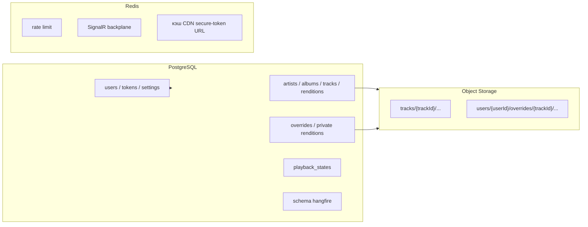
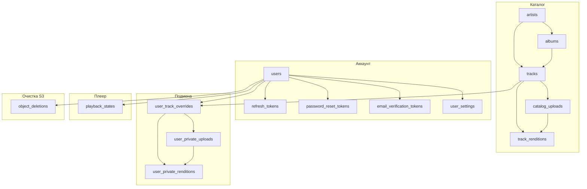
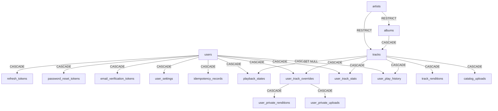

# Database overview

Версия: 1.3
СУБД: **PostgreSQL 16**  
ORM: Entity Framework Core (миграции — единственный способ менять схему)  
Связанные документы: [00-ai-agents.md](00-ai-agents.md), [01-product-plan.md](01-product-plan.md), [03-api-contract.md](03-api-contract.md), [04-operations.md](04-operations.md), [05-local-setup.md](05-local-setup.md).

Аудиофайлы в PostgreSQL **не хранятся**. В таблицах только метаданные и ключи объектов в Object Storage (прод — Yandex, локально MinIO).

---

## 1. Зачем этот документ

Зафиксировать целевую схему MVP так, чтобы по нему можно было написать EF-модели и миграции без догадок: таблицы, поля, типы, ключи, индексы, каскады, что **не** кладём в Postgres.

Имена таблиц и колонок — `snake_case`. В C# — PascalCase, маппинг через Npgsql snake_case naming или явные `[Column]`.

---

## 2. Что где лежит



| Данные | Где |
|---|---|
| Пользователи, пароли (хеш), роли | PostgreSQL `users` |
| Refresh / reset / email verification tokens | PostgreSQL |
| Каталог, generation загрузок и качества | PostgreSQL + объекты S3 `tracks/...` |
| Подмена, generation загрузок и private renditions | PostgreSQL + объекты S3 `users/{userId}/...` |
| Надёжное удаление объектов | PostgreSQL `object_deletions` + Hangfire |
| Idempotency authenticated mutations | PostgreSQL `idempotency_records` |
| Now playing, эфемерная очередь | PostgreSQL `playback_states` (снимок); realtime — SignalR/Redis |
| Счётчик и история прослушиваний | PostgreSQL `user_track_stats`, `user_play_history` (не `listen_events`) |
| Локальный URI/bookmark файла | **только клиент**, не в БД |
| CDN secure-token URL | не персистить; Redis-кэш owner-aware и короче TTL подписи |
| S3 multipart upload ID | PostgreSQL в строке upload generation до complete/abort |
| Rate limit API | Redis, матрица в `03-api-contract.md` |
| Джобы Hangfire | схема `hangfire` (создаёт библиотека, не EF) |
| ListenEvent, плейлисты, reco | **нет в MVP** — таблицы не создавать |

---

## 3. Соглашения

| Тема | Правило |
|---|---|
| PK | `uuid`, default `gen_random_uuid()` |
| Время | `timestamptz`, API пишет **UTC** |
| Мягкое удаление | нет в MVP; удаление — hard delete + каскад по таблице ниже |
| Enum в БД | `text` + `CHECK (...)`. Не PostgreSQL ENUM (больнее мигрировать в EF) |
| Деньги/секреты | пароль и токены — только хеш (`text`). Сырой JWT/пароль не писать |
| Email | `lower(btrim(email))`; CHECK и unique index на `lower(email)` |
| Login | уникальность **без учёта регистра** (`lower(login)`); формат `[a-zA-Z0-9_.-]{3,32}` проверяет API |
| Поиск | `pg_trgm`; индексы GIN на именах каталога |
| Аудио | `bucket_key` — ключ объекта, не URL и не байты |
| Чужой private | адресация только `(currentUserId, trackId, generationId/profileCode)`; для чужого — 404 |
| Межсистемное удаление | только через transactional outbox `object_deletions`, не «S3 затем DB» |

Схемы:

- `public` — приложение (этот документ).
- `hangfire` — таблицы Hangfire, руками не описываем и в DbContext не включаем.

Расширения (включить первой миграцией):

```sql
CREATE EXTENSION IF NOT EXISTS pgcrypto;  -- gen_random_uuid
CREATE EXTENSION IF NOT EXISTS pg_trgm;   -- поиск
```

---

## 4. Диаграмма (ER)

```mermaid
erDiagram
  users ||--o{ refresh_tokens : "1:N"
  users ||--o{ password_reset_tokens : "1:N"
  users ||--o{ email_verification_tokens : "1:N"
  users ||--|| user_settings : "1:1"
  users ||--o| playback_states : "1:1"
  users ||--o{ user_track_overrides : "1:N"
  users ||--o{ user_private_renditions : "1:N"
  users ||--o{ object_deletions : "1:N"
  users ||--o{ idempotency_records : "1:N"

  artists ||--o{ albums : "1:N"
  artists ||--o{ tracks : "1:N"
  albums ||--o{ tracks : "1:N"
  tracks ||--o{ track_renditions : "1:N"
  tracks ||--o{ catalog_uploads : "1:N"
  catalog_uploads ||--o{ track_renditions : "1:N"

  tracks ||--o{ user_track_overrides : "1:N"
  tracks ||--o{ user_private_renditions : "1:N"
  user_track_overrides ||--o{ user_private_uploads : "1:N"
  user_track_overrides ||--o{ user_private_renditions : "1:N"
  user_private_uploads ||--o{ user_private_renditions : "1:N"

  users {
    uuid id PK
    text login "null unique ci"
    text email "null unique"
    timestamptz email_verified_at "null"
    text password_hash
    text role
    timestamptz created_at
    timestamptz updated_at
  }

  refresh_tokens {
    uuid id PK
    uuid user_id FK
    text token_hash UK
    uuid device_id
    uuid family_id
    uuid parent_token_id "null"
    timestamptz expires_at
    timestamptz revoked_at "null"
    timestamptz created_at
  }

  password_reset_tokens {
    uuid id PK
    uuid user_id FK
    text token_hash UK
    timestamptz expires_at
    timestamptz used_at "null"
    timestamptz invalidated_at "null"
    timestamptz created_at
  }

  email_verification_tokens {
    uuid id PK
    uuid user_id FK
    text pending_email
    text purpose
    text token_hash UK
    timestamptz expires_at
    timestamptz used_at "null"
    timestamptz invalidated_at "null"
  }

  user_settings {
    uuid user_id PK_FK
    text preferred_quality
    timestamptz updated_at
  }

  user_track_stats {
    uuid user_id PK_FK
    uuid track_id PK_FK
    int play_count
    timestamptz last_played_at
  }

  user_play_history {
    uuid id PK
    uuid user_id FK
    uuid track_id FK
    timestamptz played_at
  }

  artists {
    uuid id PK
    text name
    text sort_name
    timestamptz created_at
  }

  albums {
    uuid id PK
    uuid artist_id FK
    text title
    int year "null"
    text cover_object_key "null"
    timestamptz created_at
  }

  tracks {
    uuid id PK
    uuid album_id FK
    uuid artist_id FK
    text title
    int track_number
    int duration_ms "null"
    text isrc "null"
    timestamptz created_at
    timestamptz updated_at
  }

  track_renditions {
    uuid id PK
    uuid track_id FK
    uuid generation_id FK
    text profile_code
    text status
    text bucket_key "null"
    text content_type "null"
    int bitrate_kbps "null"
    bigint size_bytes "null"
    int duration_ms "null"
    text error_message "null"
    timestamptz created_at
    timestamptz updated_at
  }

  catalog_uploads {
    uuid generation_id PK
    uuid track_id FK
    text status
    boolean is_active
    text multipart_upload_id "null"
    text source_bucket_key
    timestamptz lease_expires_at "null"
  }

  user_track_overrides {
    uuid user_id PK_FK
    uuid track_id PK_FK
    text source_preference
    text display_name "null"
    int duration_ms "null"
    bigint size_bytes "null"
    timestamptz updated_at
  }

  user_private_uploads {
    uuid generation_id PK
    uuid user_id FK
    uuid track_id FK
    text status
    boolean is_active
    text multipart_upload_id "null"
    bigint size_bytes
    int duration_ms "null"
    timestamptz lease_expires_at "null"
  }

  user_private_renditions {
    uuid id PK
    uuid user_id FK
    uuid track_id FK
    uuid generation_id FK
    text profile_code
    text status
    text bucket_key "null"
    text content_type "null"
    int bitrate_kbps "null"
    bigint size_bytes "null"
    int duration_ms "null"
    text error_message "null"
    timestamptz created_at
    timestamptz updated_at
  }

  playback_states {
    uuid user_id PK_FK
    uuid track_id FK "null"
    int position_ms
    boolean is_playing
    text quality_code "null"
    text source "null"
    uuid device_id "null"
    jsonb queue
    bigint revision
    uuid writer_session_id "null"
    timestamptz updated_at
  }

  object_deletions {
    uuid id PK
    text bucket_key
    text status
    int attempt_count
    timestamptz next_attempt_at
  }

  idempotency_records {
    uuid id PK
    uuid user_id FK
    text route
    uuid idempotency_key
    text request_hash
    timestamptz expires_at
  }
```

`catalog_uploads` и `user_private_uploads` — immutable generation. Рендиция принадлежит конкретной generation; только одна `ready` generation на трек/override может иметь `is_active = true`. Старые джобы обновляют строки только при совпадении `generation_id` и никогда не публикуют более новую generation.

---

## 5. Домены (логически)



---

## 6. Справочник допустимых значений

Хранятся как `text` + CHECK. Клиент не придумывает новые коды.

### 6.1. `users.role`

| Значение | Смысл |
|---|---|
| `user` | слушатель |
| `admin` | каталог, Hangfire dashboard, загрузка исходников каталога |

### 6.2. Профиль качества `profile_code`

Совпадает с FFmpeg-профилями. Одинаков для каталога и private.

| Значение | Кодек | Битрейт |
|---|---|---|
| `aac_128` | AAC в m4a | 128 kbps |
| `aac_256` | AAC в m4a | 256 kbps |
| `src` | как загружено | исходник; в выдачу клиенту — только если файл пригоден для стрима |

### 6.3. `user_settings.preferred_quality`

`auto` | `aac_128` | `aac_256` | `src`  
`auto` = первая Ready по порядку `aac_256` → `aac_128`. `src` не участвует в auto и доступен только после проверки stream eligibility.

### 6.4. Статус рендиции `status`

`pending` → `processing` → `ready` | `failed`

Статус upload generation:

`initiated` → `uploading` → `uploaded` → `validating` → `processing` → `ready` | `failed` | `cancelled` | `deleting`.

`processing` имеет lease. Истёкший lease допускает atomic reclaim той же generation. Переход в `ready/is_active` выполняется транзакционно и только после S3 HEAD + ffprobe.

### 6.5. Источник `source_preference` / `playback_states.source`

| Значение | Что играет |
|---|---|
| `auto` | Local → активная Ready Private → Catalog |
| `catalog` | CDN secure-token URL каталожной рендиции |
| `local` | файл на устройстве (URI в БД нет) |
| `private` | CDN secure-token URL `user_private_renditions` владельца |

### 6.6. `playback_states.queue` (jsonb)

```json
{
  "schemaVersion": 1,
  "repeat": "off",
  "shuffle": false,
  "currentItemId": "uuid-or-null",
  "items": [
    { "itemId": "uuid", "trackId": "uuid", "sourcePreference": "auto" }
  ]
}
```

`repeat`: `off` | `one` | `all`. `itemId` различает повторяющиеся `trackId`. При shuffle в `items` хранится уже фактический порядок. Максимум 500 items и 256 KiB сериализованного JSON. Пустая очередь содержит `currentItemId: null`; не `NULL`. Полную схему валидирует API, DB проверяет обязательные верхнеуровневые поля и размер.

---

## 7. Таблицы

### 7.1. `users`

Одна строка — один аккаунт. Регистрация MVP сразу пишет и `login`, и `email`. DB-инвариант — **минимум один** идентификатор. Email участвует во входе/reset только при `email_verified_at IS NOT NULL`. Смена login/email после регистрации в продукт MVP не входит.

| Колонка | Тип | Null | Описание |
|---|---|---|---|
| `id` | `uuid` | нет | PK |
| `login` | `text` | да | уникален среди не-null, сравнение `lower(login)` |
| `email` | `text` | да | `lower(btrim(email))`, уникален без учёта регистра |
| `email_verified_at` | `timestamptz` | да | NULL до подтверждения |
| `password_hash` | `text` | нет | ASP.NET `PasswordHasher` |
| `role` | `text` | нет | `user` / `admin`, default `user` |
| `created_at` | `timestamptz` | нет | |
| `updated_at` | `timestamptz` | нет | |

Ограничения:

```text
PK (id)
CHECK (login IS NOT NULL OR email IS NOT NULL)
CHECK (role IN ('user', 'admin'))
CHECK (login IS NULL OR login ~ '^[a-zA-Z0-9_.-]{3,32}$')
CHECK (email IS NULL OR email = lower(btrim(email)))
CHECK (email IS NULL OR char_length(email) BETWEEN 3 AND 254)
CHECK (email_verified_at IS NULL OR email IS NOT NULL)
CHECK (char_length(password_hash) > 0)
UNIQUE INDEX ux_users_email_lower ON users (lower(email)) WHERE email IS NOT NULL
UNIQUE INDEX ux_users_login_lower ON users (lower(login)) WHERE login IS NOT NULL
```

Каскад: удаление пользователя удаляет токены, settings, overrides, private renditions, playback_state.

---

### 7.2. `refresh_tokens`

Хеш refresh-токена. Сырое значение — только клиенту, один раз.

| Колонка | Тип | Null | Описание |
|---|---|---|---|
| `id` | `uuid` | нет | PK |
| `user_id` | `uuid` | нет | FK → `users` ON DELETE CASCADE |
| `token_hash` | `text` | нет | UNIQUE |
| `device_id` | `uuid` | нет | UUID с клиента |
| `family_id` | `uuid` | нет | одна цепочка rotation |
| `parent_token_id` | `uuid` | да | self-FK → `refresh_tokens`, ON DELETE SET NULL |
| `expires_at` | `timestamptz` | нет | |
| `revoked_at` | `timestamptz` | да | logout / logout-all / ротация |
| `revoke_reason` | `text` | да | `rotated` / `logout` / `logout_all` / `reset` / `reuse` |
| `created_at` | `timestamptz` | нет | |

Индексы: `(user_id)`, `(user_id, device_id)`, `(family_id)`, `(expires_at)`.

Logout-all: `UPDATE ... SET revoked_at = now() WHERE user_id = :id AND revoked_at IS NULL`.

Rotation — одна транзакция: условный `UPDATE ... WHERE revoked_at IS NULL AND expires_at > now() RETURNING user_id, family_id`, затем INSERT потомка. Если погашенный `rotated` token предъявлен повторно — revoke всей family. Из двух конкурентных refresh успешен один.

---

### 7.3. `password_reset_tokens`

Одноразовые токены письма. Forgot-password **не** сообщает, существует ли email.

| Колонка | Тип | Null | Описание |
|---|---|---|---|
| `id` | `uuid` | нет | PK |
| `user_id` | `uuid` | нет | FK → `users` ON DELETE CASCADE |
| `token_hash` | `text` | нет | UNIQUE |
| `expires_at` | `timestamptz` | нет | ориентир TTL 30 мин |
| `used_at` | `timestamptz` | да | |
| `invalidated_at` | `timestamptz` | да | инвалидирован другим reset/resend |
| `created_at` | `timestamptz` | нет | |

Валидный reset consume выполняется атомарным `UPDATE ... WHERE used_at IS NULL AND invalidated_at IS NULL AND expires_at > now() RETURNING user_id`. В одной транзакции меняются password hash, выбранный token получает `used_at`, остальные активные reset-токены — `invalidated_at`, все refresh-токены отзываются. Из двух конкурентных запросов успешен один.

Hangfire только отправляет письмо; состояние — эта таблица.

Ограничения и индексы: временной порядок, `used_at` и `invalidated_at` не могут быть заданы одновременно, `(user_id)`, `(expires_at)`.

---

### 7.3a. `email_verification_tokens`

Одноразовое подтверждение email при регистрации. Pending email хранится здесь; для регистрации адрес уже резервируется в `users`, но вход/reset запрещены до verification. `purpose = 'bind'` зарезервирован схемой, в MVP не используется.

| Колонка | Тип | Null | Описание |
|---|---|---|---|
| `id` | `uuid` | нет | PK |
| `user_id` | `uuid` | нет | FK → `users` ON DELETE CASCADE |
| `pending_email` | `text` | нет | normalized lowercase |
| `purpose` | `text` | нет | `register` / `bind` |
| `token_hash` | `text` | нет | UNIQUE |
| `expires_at` | `timestamptz` | нет | TTL 24 часа |
| `used_at` | `timestamptz` | да | |
| `invalidated_at` | `timestamptz` | да | resend/смена pending email |
| `created_at` | `timestamptz` | нет | |

CHECK: normalized email, допустимый purpose, временной порядок, used/invalidated mutually exclusive. Индексы: `(user_id)`, `(expires_at)`, уникальный активный bind `pending_email` (`used_at IS NULL AND invalidated_at IS NULL AND purpose = 'bind'`). Повторная отправка ставит `invalidated_at` активным tokens того же purpose. `purpose = 'bind'` в схеме есть на будущее: смена/привязка login и email после регистрации в MVP не делается. Cleanup удаляет неподтверждённые email-only аккаунты после 24 часов.

---

### 7.4. `user_settings`

1:1 с пользователем. Строка создаётся вместе с `users` (тот же use-case регистрации).

| Колонка | Тип | Null | Default | Описание |
|---|---|---|---|---|
| `user_id` | `uuid` | нет | | PK, FK → `users` ON DELETE CASCADE |
| `preferred_quality` | `text` | нет | `auto` | `auto` / профили |
| `updated_at` | `timestamptz` | нет | | |

```text
CHECK (preferred_quality IN ('auto', 'aac_128', 'aac_256', 'src'))
```

---

### 7.5. `artists`

| Колонка | Тип | Null | Описание |
|---|---|---|---|
| `id` | `uuid` | нет | PK |
| `name` | `text` | нет | отображаемое имя |
| `sort_name` | `text` | нет | для сортировки; часто `lower(name)` |
| `created_at` | `timestamptz` | нет | |

Индексы: `GIN (name gin_trgm_ops)`, btree `(sort_name)`.  
Дубли имён в MVP разрешены (нет merge артистов).

---

### 7.6. `albums`

| Колонка | Тип | Null | Описание |
|---|---|---|---|
| `id` | `uuid` | нет | PK |
| `artist_id` | `uuid` | нет | FK → `artists` **ON DELETE RESTRICT** |
| `title` | `text` | нет | |
| `year` | `int` | да | 1000..9999 |
| `cover_object_key` | `text` | да | ключ обложки в бакете, не URL |
| `created_at` | `timestamptz` | нет | |

Индексы: `(artist_id)`, `GIN (title gin_trgm_ops)`.

CHECK: `year IS NULL OR year BETWEEN 1000 AND 9999`.

---

### 7.7. `tracks`

Карточка каталога. `duration_ms` заполняет транскод (ffprobe первой ready-рендиции), до этого NULL.

| Колонка | Тип | Null | Описание |
|---|---|---|---|
| `id` | `uuid` | нет | PK, стабильный id для override и плеера |
| `album_id` | `uuid` | нет | FK → `albums` ON DELETE CASCADE |
| `artist_id` | `uuid` | нет | FK → `artists` ON DELETE RESTRICT; может совпадать с альбомом |
| `title` | `text` | нет | |
| `track_number` | `int` | нет | порядок в альбоме, ≥ 1 |
| `duration_ms` | `int` | да | |
| `isrc` | `text` | да | под будущий импорт библиотек; в MVP пусто |
| `created_at` | `timestamptz` | нет | |
| `updated_at` | `timestamptz` | нет | |

```text
CHECK (track_number >= 1)
CHECK (duration_ms IS NULL OR duration_ms > 0)
UNIQUE INDEX ux_tracks_isrc ON tracks (isrc) WHERE isrc IS NOT NULL
UNIQUE INDEX ux_tracks_album_number ON tracks (album_id, track_number)
INDEX ix_tracks_artist ON tracks (artist_id)
GIN (title gin_trgm_ops)
```

Поиск **не** джойнит `user_private_renditions` и `user_track_overrides` других пользователей.

---

### 7.8. `catalog_uploads`

Одна immutable generation исходника каталога. Повторная загрузка всегда создаёт новый `generation_id`; старая активная generation продолжает играть до атомарной публикации новой.

| Колонка | Тип | Null | Описание |
|---|---|---|---|
| `generation_id` | `uuid` | нет | PK |
| `track_id` | `uuid` | нет | FK → `tracks` ON DELETE CASCADE |
| `status` | `text` | нет | upload state machine из §6.4 |
| `is_active` | `boolean` | нет | default false |
| `multipart_upload_id` | `text` | да | очищается после complete/abort |
| `source_bucket_key` | `text` | нет | generation-aware key |
| `expected_checksum_sha256` | `text` | нет | full-file hash из initiate |
| `computed_checksum_sha256` | `text` | да | worker вычисляет чтением source |
| `size_bytes` | `bigint` | да | > 0 |
| `duration_ms` | `int` | да | > 0 |
| `lease_expires_at` | `timestamptz` | да | reclaim зависшего processing |
| `created_at` / `updated_at` | `timestamptz` | нет | |

Partial UNIQUE `(track_id) WHERE is_active`; active допустим только при `status='ready'`. Индексы `(track_id, created_at)`, `(status, lease_expires_at)`.

---

### 7.9. `track_renditions`

Только **каталог**. Один профиль — одна строка на upload generation.

| Колонка | Тип | Null | Описание |
|---|---|---|---|
| `id` | `uuid` | нет | PK |
| `track_id` | `uuid` | нет | FK → `tracks` ON DELETE CASCADE |
| `generation_id` | `uuid` | нет | FK → `catalog_uploads` ON DELETE CASCADE |
| `profile_code` | `text` | нет | `aac_128` / `aac_256` / `src` |
| `status` | `text` | нет | |
| `bucket_key` | `text` | да | generation-aware key; NULL пока нет объекта |
| `content_type` | `text` | да | `audio/mp4` |
| `bitrate_kbps` | `int` | да | |
| `size_bytes` | `bigint` | да | |
| `duration_ms` | `int` | да | |
| `error_message` | `text` | да | без секретов S3 и без signed URL |
| `created_at` | `timestamptz` | нет | |
| `updated_at` | `timestamptz` | нет | |

```text
UNIQUE (generation_id, profile_code)
FOREIGN KEY (track_id, generation_id)
  REFERENCES catalog_uploads (track_id, generation_id) ON DELETE CASCADE
CHECK (profile_code IN ('aac_128', 'aac_256', 'src'))
CHECK (status IN ('pending', 'processing', 'ready', 'failed'))
CHECK (bitrate_kbps IS NULL OR bitrate_kbps > 0)
CHECK (size_bytes IS NULL OR size_bytes > 0)
CHECK (duration_ms IS NULL OR duration_ms > 0)
CHECK (status <> 'ready' OR
  (bucket_key IS NOT NULL AND content_type IS NOT NULL AND size_bytes > 0 AND duration_ms > 0))
INDEX ix_track_renditions_ready ON track_renditions (track_id, generation_id) WHERE status = 'ready'
```

Ключи только `tracks/{trackId}/generations/{generationId}/...`. Пользовательские файлы сюда не писать.

Клиенту в `availableQualities` отдавать Ready-строки только активной Ready generation.

---

### 7.10. `user_track_overrides`

Персональная подмена каталожного трека. Локальный URI **не хранится**.

| Колонка | Тип | Null | Default | Описание |
|---|---|---|---|---|
| `user_id` | `uuid` | нет | | PK, FK → `users` CASCADE |
| `track_id` | `uuid` | нет | | PK, FK → `tracks` CASCADE |
| `source_preference` | `text` | нет | `auto` | `auto` / `catalog` / `local` / `private` |
| `display_name` | `text` | да | | имя файла для UI |
| `duration_ms` | `int` | да | | длительность локального/загруженного |
| `size_bytes` | `bigint` | да | | исходник |
| `updated_at` | `timestamptz` | нет | | |

```text
PRIMARY KEY (user_id, track_id)
CHECK (source_preference IN ('auto', 'catalog', 'local', 'private'))
CHECK (duration_ms IS NULL OR duration_ms > 0)
CHECK (size_bytes IS NULL OR size_bytes > 0)
INDEX ix_overrides_track ON user_track_overrides (track_id)
```

`hasReadyPrivate` вычисляется как EXISTS активной `user_private_uploads(status='ready')` с Ready rendition; хранимого boolean нет. `source_preference='private'` не гарантирует доступность: resolver применяет заметный fallback.

`deletePrivateCopy` сохраняет override/local metadata; `deleteOverride` удаляет всю привязку. В обоих случаях DB-изменение и строки `object_deletions` создаются одной транзакцией; S3 напрямую из request не удаляется.

---

### 7.11. `user_private_uploads`

Immutable generation private-исходника. Один active Ready upload на `(user_id, track_id)`.

| Колонка | Тип | Null | Описание |
|---|---|---|---|
| `generation_id` | `uuid` | нет | PK |
| `user_id` / `track_id` | `uuid` | нет | составной FK → override CASCADE |
| `status` | `text` | нет | upload state machine |
| `is_active` | `boolean` | нет | default false |
| `multipart_upload_id` | `text` | да | для resume/abort |
| `source_bucket_key` | `text` | нет | immutable generation key |
| `expected_checksum_sha256` | `text` | нет | full-file hash из initiate |
| `computed_checksum_sha256` | `text` | да | worker вычисляет чтением source |
| `size_bytes` | `bigint` | да | максимум 100 MiB |
| `duration_ms` | `int` | да | максимум 3 600 000 ms |
| `lease_expires_at` | `timestamptz` | да | |
| `created_at` / `updated_at` | `timestamptz` | нет | |

Ограничения: `(user_id, track_id, generation_id)` UNIQUE; partial UNIQUE `(user_id, track_id) WHERE is_active`; active только при Ready; положительные и верхние лимиты size/duration. Initiate под row/advisory lock пользователя резервирует заявленный `size_bytes`; квота 2 GiB считается по всем не удалённым/reserved private source objects и перепроверяется по фактическому HEAD.

---

### 7.12. `user_private_renditions`

Приватные качества **владельца**. Чужой `user_id` не должен уметь прочитать строку (фильтр в запросе; для API — 404).

| Колонка | Тип | Null | Описание |
|---|---|---|---|
| `id` | `uuid` | нет | PK |
| `user_id` | `uuid` | нет | часть FK на override |
| `track_id` | `uuid` | нет | часть FK на override |
| `generation_id` | `uuid` | нет | FK → `user_private_uploads` |
| `profile_code` | `text` | нет | |
| `status` | `text` | нет | |
| `bucket_key` | `text` | да | **только** `users/{userId}/overrides/{trackId}/...` |
| `content_type` | `text` | да | |
| `bitrate_kbps` | `int` | да | |
| `size_bytes` | `bigint` | да | |
| `duration_ms` | `int` | да | |
| `error_message` | `text` | да | |
| `created_at` | `timestamptz` | нет | |
| `updated_at` | `timestamptz` | нет | |

```text
UNIQUE (generation_id, profile_code)
FOREIGN KEY (user_id, track_id, generation_id)
  REFERENCES user_private_uploads (user_id, track_id, generation_id) ON DELETE CASCADE
CHECK (profile_code IN ('aac_128', 'aac_256', 'src'))
CHECK (status IN ('pending', 'processing', 'ready', 'failed'))
CHECK (bitrate_kbps IS NULL OR bitrate_kbps > 0)
CHECK (size_bytes IS NULL OR size_bytes > 0)
CHECK (duration_ms IS NULL OR duration_ms > 0)
CHECK (status <> 'ready' OR
  (bucket_key IS NOT NULL AND content_type IS NOT NULL AND size_bytes > 0 AND duration_ms > 0))
INDEX ix_private_renditions_ready
  ON user_private_renditions (user_id, track_id, generation_id) WHERE status = 'ready'
```

Каталожный поиск / `GET /api/v1/tracks/{id}` эти строки **не** включают.

Админ-каталог их не показывает. Hangfire знает `user_id` из аргумента джобы, не из «всех рендиций мира».

---

### 7.13. `playback_states`

Один authoritative snapshot на пользователя. Порядок задаёт `revision`, а `updated_at` служит только временем аудита.

| Колонка | Тип | Null | Описание |
|---|---|---|---|
| `user_id` | `uuid` | нет | PK, FK → `users` CASCADE |
| `track_id` | `uuid` | да | FK → `tracks` ON DELETE SET NULL; пустой плеер |
| `position_ms` | `int` | нет | default 0, ≥ 0 |
| `is_playing` | `boolean` | нет | |
| `quality_code` | `text` | да | `auto` или профиль |
| `source` | `text` | да | `catalog` / `local` / `private` |
| `device_id` | `uuid` | да | кто отправил последний state |
| `writer_session_id` | `uuid` | да | текущая playback session |
| `revision` | `bigint` | нет | default 0, монотонно растёт |
| `queue` | `jsonb` | нет | см. §6.6 |
| `updated_at` | `timestamptz` | нет | |

```text
CHECK (position_ms >= 0)
CHECK (source IS NULL OR source IN ('catalog', 'local', 'private'))
CHECK (quality_code IS NULL OR quality_code IN ('auto', 'aac_128', 'aac_256', 'src'))
CHECK (revision >= 0)
CHECK (jsonb_typeof(queue) = 'object' AND
       queue->>'schemaVersion' = '1' AND
       queue->>'repeat' IN ('off', 'one', 'all') AND
       queue ? 'currentItemId' AND
       jsonb_typeof(queue->'items') = 'array' AND
       jsonb_typeof(queue->'shuffle') = 'boolean' AND
       jsonb_array_length(queue->'items') <= 500 AND
       octet_length(queue::text) <= 262144)
CHECK (track_id IS NOT NULL OR
       (position_ms = 0 AND is_playing = false AND source IS NULL AND quality_code IS NULL))
```

Presence и реестр server-generated writer sessions в Postgres не дублируем: online/session ownership validation — SignalR + Redis; committed active `writer_session_id` остаётся в snapshot.

Update: `UPDATE ... SET ..., revision = revision + 1 WHERE user_id=:user AND revision=:expected RETURNING revision`. Broadcast — только после commit. Progress update меняет только position/current item и не переносит старые command fields.

---

### 7.14. `object_deletions`

Transactional outbox для S3. Строка создаётся в той же DB-транзакции, которая удаляет/деактивирует metadata.

| Колонка | Тип | Null | Описание |
|---|---|---|---|
| `id` | `uuid` | нет | PK |
| `owner_user_id` | `uuid` | да | audit/tenant; ON DELETE SET NULL |
| `bucket_key` | `text` | нет | точный object key, не URL |
| `status` | `text` | нет | `pending` / `processing` / `done` / `failed` |
| `attempt_count` | `int` | нет | default 0 |
| `next_attempt_at` | `timestamptz` | нет | |
| `lease_expires_at` | `timestamptz` | да | |
| `last_error` | `text` | да | без signed URL/секретов |
| `created_at` / `completed_at` | `timestamptz` | нет/да | |

UNIQUE `(bucket_key)` для незавершённой записи выражается partial index. Job считает S3 404 успешным, использует backoff и lease. `done` хранится 30 дней; reconciler перечисляет orphan/temp objects и создаёт отдельную outbox-строку для каждого key.

---

### 7.15. `idempotency_records`

Durable replay authenticated mutation из `03-api-contract.md`; access/refresh/login responses с секретами здесь не хранятся.

| Колонка | Тип | Null | Описание |
|---|---|---|---|
| `id` | `uuid` | нет | PK |
| `user_id` | `uuid` | нет | FK → users CASCADE |
| `route` | `text` | нет | route template |
| `idempotency_key` | `uuid` | нет | ключ клиента |
| `request_hash` | `text` | нет | SHA-256 canonical request |
| `response_status` | `int` | нет | исходный HTTP status |
| `response_body` | `jsonb` | да | без token/URL secrets |
| `created_at` / `expires_at` | `timestamptz` | нет | TTL 24 часа |

UNIQUE `(user_id, route, idempotency_key)`, индекс `(expires_at)`. Транзакция сначала берёт advisory lock по `(user, route, key)`, затем проверяет replay, выполняет domain mutation и вставляет completed record перед commit. Конкурент ждёт lock и после commit возвращает сохранённый ответ; durable `in_progress` состояния нет. Тот же key с другим hash даёт conflict.

---

### 7.16. `user_track_stats`

Счётчик прослушиваний **на пользователя и трек**. Не `listen_events` (то имя зарезервировано под рекомендации).

| Колонка | Тип | Null | Описание |
|---|---|---|---|
| `user_id` | `uuid` | нет | PK, FK → users CASCADE |
| `track_id` | `uuid` | нет | PK, FK → tracks CASCADE |
| `play_count` | `int` | нет | ≥ 1 |
| `last_played_at` | `timestamptz` | нет | |

Обложка артиста для текущего пользователя: альбом с максимальной суммой `play_count` по его трекам (нужна `cover_object_key`); иначе любой альбом с обложкой.

---

### 7.17. `user_play_history`

Журнал стартов трека. Повтор того же трека в 30 с API не пишет.

| Колонка | Тип | Null | Описание |
|---|---|---|---|
| `id` | `uuid` | нет | PK |
| `user_id` | `uuid` | нет | FK → users CASCADE |
| `track_id` | `uuid` | нет | FK → tracks CASCADE |
| `played_at` | `timestamptz` | нет | |

Индекс `(user_id, played_at, id)` для cursor-страницы истории.

---

## 8. Каскады (сводка)



Удалить артиста, пока на него ссылаются альбомы/треки — нельзя. Сначала контент.

Перед hard delete пользователя/альбома/трека сервис в той же транзакции материализует все object keys в `object_deletions`, затем удаляет DB-строки каскадом. Cleanup-job удаляет S3 после commit; 404 идемпотентен. Запрещено удалять S3 до фиксации outbox.

`playback_states.track_id` использует SET NULL, но application service дополнительно очищает `is_playing/source/quality/position` и вырезает удалённые track IDs из queue; чтение snapshot также безопасно prune отсутствующие IDs.

---

## 9. Ключи в Object Storage (не колонки, но контракт)

| Вид | Шаблон `bucket_key` |
|---|---|
| Исходник каталога | `tracks/{trackId}/generations/{generationId}/source` |
| Каталог AAC | `tracks/{trackId}/generations/{generationId}/aac_128.m4a` |
| Обложка | `catalog/covers/{albumId}` |
| Исходник private | `users/{userId}/overrides/{trackId}/generations/{generationId}/source` |
| Private AAC | `users/{userId}/overrides/{trackId}/generations/{generationId}/aac_256.m4a` |

Исходное имя файла в key не включается: после sanitization оно остаётся только в `display_name`. Job проверяет scope и generation перед записью и перед publish. Private API не принимает глобальный rendition id: только owner-scoped route после ACL.

---

## 10. Индексы — полный список

| Имя | Таблица | Определение |
|---|---|---|
| `pk_*` | все | PK как выше |
| `ux_users_email_lower` | `users` | `(lower(email)) WHERE email IS NOT NULL` |
| `ux_users_login_lower` | `users` | `(lower(login)) WHERE login IS NOT NULL` |
| `ix_refresh_tokens_user` | `refresh_tokens` | `(user_id)` |
| `ix_refresh_tokens_device` | `refresh_tokens` | `(user_id, device_id)` |
| `ix_refresh_tokens_family` | `refresh_tokens` | `(family_id)` |
| `ix_refresh_tokens_expiry` | `refresh_tokens` | `(expires_at)` |
| `ux_refresh_tokens_hash` | `refresh_tokens` | `(token_hash)` |
| `ux_password_reset_hash` | `password_reset_tokens` | `(token_hash)` |
| `ix_password_reset_user` | `password_reset_tokens` | `(user_id)` |
| `ix_password_reset_expiry` | `password_reset_tokens` | `(expires_at)` |
| `ux_email_verification_hash` | `email_verification_tokens` | `(token_hash)` |
| `ix_email_verification_user` | `email_verification_tokens` | `(user_id)` |
| `ix_email_verification_expiry` | `email_verification_tokens` | `(expires_at)` |
| `ix_albums_artist` | `albums` | `(artist_id)` |
| `gin_artists_name` | `artists` | `USING gin (name gin_trgm_ops)` |
| `ix_artists_sort_name` | `artists` | `(sort_name)` |
| `gin_albums_title` | `albums` | `USING gin (title gin_trgm_ops)` |
| `gin_tracks_title` | `tracks` | `USING gin (title gin_trgm_ops)` |
| `ux_tracks_album_number` | `tracks` | UNIQUE `(album_id, track_number)` |
| `ix_tracks_artist` | `tracks` | `(artist_id)` |
| `ux_tracks_isrc` | `tracks` | `(isrc) WHERE isrc IS NOT NULL` |
| `ux_catalog_upload_active` | `catalog_uploads` | `(track_id) WHERE is_active` |
| `ux_catalog_upload_track_generation` | `catalog_uploads` | `(track_id, generation_id)` |
| `ix_catalog_upload_lease` | `catalog_uploads` | `(status, lease_expires_at)` |
| `ix_catalog_upload_track_created` | `catalog_uploads` | `(track_id, created_at)` |
| `ux_track_renditions_profile` | `track_renditions` | `(generation_id, profile_code)` |
| `ux_track_renditions_bucket` | `track_renditions` | `(bucket_key) WHERE bucket_key IS NOT NULL` |
| `ix_track_renditions_ready` | `track_renditions` | `(track_id, generation_id) WHERE status = 'ready'` |
| `pk_overrides` | `user_track_overrides` | `(user_id, track_id)` |
| `ix_overrides_track` | `user_track_overrides` | `(track_id)` |
| `ux_private_upload_active` | `user_private_uploads` | `(user_id, track_id) WHERE is_active` |
| `ux_private_upload_owner_generation` | `user_private_uploads` | `(user_id, track_id, generation_id)` |
| `ix_private_upload_lease` | `user_private_uploads` | `(status, lease_expires_at)` |
| `ux_private_renditions_profile` | `user_private_renditions` | `(generation_id, profile_code)` |
| `ux_private_renditions_bucket` | `user_private_renditions` | `(bucket_key) WHERE bucket_key IS NOT NULL` |
| `ix_private_renditions_ready` | `user_private_renditions` | `(user_id, track_id, generation_id) WHERE status = 'ready'` |
| `ix_playback_track` | `playback_states` | `(track_id) WHERE track_id IS NOT NULL` |
| `ux_object_deletions_pending` | `object_deletions` | `(bucket_key) WHERE status <> 'done'` |
| `ix_object_deletions_due` | `object_deletions` | `(status, next_attempt_at)` |
| `ix_object_deletions_owner` | `object_deletions` | `(owner_user_id)` |
| `ux_idempotency_scope` | `idempotency_records` | `(user_id, route, idempotency_key)` |
| `ix_idempotency_expiry` | `idempotency_records` | `(expires_at)` |
| `ix_user_track_stats_track` | `user_track_stats` | `(track_id)` |
| `ix_user_play_history_user` | `user_play_history` | `(user_id, played_at, id)` |
| `ix_user_play_history_track` | `user_play_history` | `(track_id)` |

Поиск:

```sql
-- API объединяет track / album / artist results.
-- q: 2..100 символов; %, _ и \ экранируются для ILIKE.
SELECT id, title, similarity(title, :q) AS rank
FROM tracks
WHERE title % :q OR title ILIKE '%' || :escapedQ || '%' ESCAPE '\'
ORDER BY rank DESC, title, id
LIMIT :limit; -- 1..50, cursor содержит rank/title/id
```

Никогда:

```sql
-- запрещено в публичном поиске
SELECT ... FROM user_private_renditions WHERE display/name ILIKE ...
```

---

## 11. Типовые запросы доступа

Каталожные качества для плеера:

```sql
SELECT r.profile_code, r.bitrate_kbps, r.bucket_key
FROM catalog_uploads u
JOIN track_renditions r ON r.generation_id = u.generation_id
WHERE u.track_id = :trackId AND u.is_active AND u.status = 'ready'
  AND r.status = 'ready';
```

Private качества **только владельца**:

```sql
SELECT profile_code, bitrate_kbps, bucket_key
FROM user_private_uploads u
JOIN user_private_renditions r ON r.generation_id = u.generation_id
WHERE u.user_id = :currentUserId
  AND u.track_id = :trackId
  AND u.is_active AND u.status = 'ready'
  AND r.status = 'ready';
```

Чужой user: 0 строк → API 404, не 403.

Override для карточки:

```sql
SELECT *
FROM user_track_overrides
WHERE user_id = :currentUserId AND track_id = :trackId;
```

---

## 12. Seed (Development)

- 1× `users`: `role = admin`, идентификатор из env ([05-local-setup.md](05-local-setup.md)).
- 1× `user_settings` для него.
- Фейковый каталог: `CatalogSeeder` пишет artists/albums/tracks с префиксом **`[SEED DATA]`** и фиксированными GUID. В Production / режиме `deploy` сидер не запускается.
- Рендиции **не** создаёт CatalogSeeder. Ready `track_renditions` появляются после admin multipart + Hangfire: `devops/seed-local-music` (папка `no_commit/music`) или `upload-catalog-source.ps1`.

Пароль admin — только хеш. Сырой пароль — [05-local-setup.md](05-local-setup.md), не таблица.

---

## 13. Hangfire

Схема `hangfire`, таблицы создаёт `Hangfire.PostgreSql`. В обзор приложения не входят. Не делать FK из `public` в `hangfire`. Аргумент transcode job всегда содержит `generationId` вместе с `trackId`/`userId`. Claim/retry/publish используют CAS и lease; stale job перечисляет известные objects своей generation в outbox. Периодические jobs: expired tokens, abandoned multipart, stale processing, outbox delivery и storage reconciliation.

---

## 14. Чего нет в MVP (не создавать)

| Таблица | Когда понадобится |
|---|---|
| `listen_events` | рекомендации |
| `track_popularity`, `track_similar` | рекомендации |
| `playlists`, `playlist_tracks` | плейлисты / избранное |
| `liked_tracks` | избранное |
| `oauth_accounts` | Яндекс OAuth |
| `devices` | если presence переедет из Redis |
| `album_artists` M:N | сборники сложнее текущего `tracks.artist_id` |

Имена зарезервированы: не занимать их для другого смысла.

---

## 15. EF Core (заметки к реализации)

- `HasCheckConstraint` для всех CHECK из этого файла.
- Expression/partial indexes `lower(email)`, `lower(login)` и active/outbox uniqueness допускают raw SQL в EF migration.
- `PlaybackState.Queue` — `jsonb`, `OwnsOne` не обязателен; `jsonb` + сериализация DTO.
- Не включать Hangfire entity.
- `OnDelete` как в §8.
- Generation composite FK на upload tables настраивать через `HasPrincipalKey`.
- Все state transitions, token consume, publish generation и outbox insert выполняются транзакционно с проверкой количества затронутых строк.

Строка `user_settings` и опционально пустой `playback_states` — в том же транзакционном `SaveChanges`, что и `users` при register.

---

## 16. Целевой DDL (ориентир)

Ниже — целевое состояние, не копировать вместо миграций EF. Для ревью и DBA.

```sql
CREATE EXTENSION IF NOT EXISTS pgcrypto;
CREATE EXTENSION IF NOT EXISTS pg_trgm;

CREATE TABLE users (
    id              uuid PRIMARY KEY DEFAULT gen_random_uuid(),
    login           text NULL,
    email           text NULL,
    email_verified_at timestamptz NULL,
    password_hash   text NOT NULL,
    role            text NOT NULL DEFAULT 'user',
    created_at      timestamptz NOT NULL DEFAULT now(),
    updated_at      timestamptz NOT NULL DEFAULT now(),
    CONSTRAINT ck_users_identifier CHECK (login IS NOT NULL OR email IS NOT NULL),
    CONSTRAINT ck_users_role CHECK (role IN ('user', 'admin')),
    CONSTRAINT ck_users_email_normalized CHECK (
        email IS NULL OR email = lower(btrim(email))
    ),
    CONSTRAINT ck_users_verified_email CHECK (
        email_verified_at IS NULL OR email IS NOT NULL
    ),
    CONSTRAINT ck_users_login_format CHECK (
        login IS NULL OR login ~ '^[a-zA-Z0-9_.-]{3,32}$'
    ),
    CONSTRAINT ck_users_email_length CHECK (
        email IS NULL OR char_length(email) BETWEEN 3 AND 254
    ),
    CONSTRAINT ck_users_password_hash CHECK (char_length(password_hash) > 0)
);
CREATE UNIQUE INDEX ux_users_email_lower ON users (lower(email)) WHERE email IS NOT NULL;
CREATE UNIQUE INDEX ux_users_login_lower ON users (lower(login)) WHERE login IS NOT NULL;

CREATE TABLE refresh_tokens (
    id           uuid PRIMARY KEY DEFAULT gen_random_uuid(),
    user_id      uuid NOT NULL REFERENCES users (id) ON DELETE CASCADE,
    token_hash   text NOT NULL,
    device_id    uuid NOT NULL,
    family_id    uuid NOT NULL,
    parent_token_id uuid NULL REFERENCES refresh_tokens (id) ON DELETE SET NULL,
    expires_at   timestamptz NOT NULL,
    revoked_at   timestamptz NULL,
    revoke_reason text NULL,
    created_at   timestamptz NOT NULL DEFAULT now(),
    CONSTRAINT ux_refresh_tokens_hash UNIQUE (token_hash),
    CONSTRAINT ck_refresh_expiry CHECK (expires_at > created_at),
    CONSTRAINT ck_refresh_revoked CHECK (revoked_at IS NULL OR revoked_at >= created_at)
);
CREATE INDEX ix_refresh_tokens_user ON refresh_tokens (user_id);
CREATE INDEX ix_refresh_tokens_device ON refresh_tokens (user_id, device_id);
CREATE INDEX ix_refresh_tokens_family ON refresh_tokens (family_id);
CREATE INDEX ix_refresh_tokens_expiry ON refresh_tokens (expires_at);

CREATE TABLE password_reset_tokens (
    id           uuid PRIMARY KEY DEFAULT gen_random_uuid(),
    user_id      uuid NOT NULL REFERENCES users (id) ON DELETE CASCADE,
    token_hash   text NOT NULL,
    expires_at   timestamptz NOT NULL,
    used_at      timestamptz NULL,
    invalidated_at timestamptz NULL,
    created_at   timestamptz NOT NULL DEFAULT now(),
    CONSTRAINT ux_password_reset_hash UNIQUE (token_hash),
    CONSTRAINT ck_reset_expiry CHECK (expires_at > created_at),
    CONSTRAINT ck_reset_used CHECK (used_at IS NULL OR used_at >= created_at),
    CONSTRAINT ck_reset_invalidated CHECK (
        invalidated_at IS NULL OR invalidated_at >= created_at
    ),
    CONSTRAINT ck_reset_terminal CHECK (
        used_at IS NULL OR invalidated_at IS NULL
    )
);
CREATE INDEX ix_password_reset_user ON password_reset_tokens (user_id);
CREATE INDEX ix_password_reset_expiry ON password_reset_tokens (expires_at);

CREATE TABLE email_verification_tokens (
    id              uuid PRIMARY KEY DEFAULT gen_random_uuid(),
    user_id         uuid NOT NULL REFERENCES users (id) ON DELETE CASCADE,
    pending_email   text NOT NULL,
    purpose         text NOT NULL,
    token_hash      text NOT NULL,
    expires_at      timestamptz NOT NULL,
    used_at         timestamptz NULL,
    invalidated_at  timestamptz NULL,
    created_at      timestamptz NOT NULL DEFAULT now(),
    CONSTRAINT ux_email_verification_hash UNIQUE (token_hash),
    CONSTRAINT ck_evt_email CHECK (pending_email = lower(btrim(pending_email))),
    CONSTRAINT ck_evt_purpose CHECK (purpose IN ('register', 'bind')),
    CONSTRAINT ck_evt_expiry CHECK (expires_at > created_at),
    CONSTRAINT ck_evt_used CHECK (used_at IS NULL OR used_at >= created_at),
    CONSTRAINT ck_evt_invalidated CHECK (
        invalidated_at IS NULL OR invalidated_at >= created_at
    ),
    CONSTRAINT ck_evt_terminal CHECK (
        used_at IS NULL OR invalidated_at IS NULL
    )
);
CREATE INDEX ix_email_verification_user ON email_verification_tokens (user_id);
CREATE INDEX ix_email_verification_expiry ON email_verification_tokens (expires_at);
CREATE UNIQUE INDEX ux_evt_pending_email_active
    ON email_verification_tokens (pending_email)
    WHERE used_at IS NULL AND invalidated_at IS NULL AND purpose = 'bind';

CREATE TABLE user_settings (
    user_id                    uuid PRIMARY KEY REFERENCES users (id) ON DELETE CASCADE,
    preferred_quality          text NOT NULL DEFAULT 'auto',
    updated_at                 timestamptz NOT NULL DEFAULT now(),
    CONSTRAINT ck_settings_quality CHECK (
        preferred_quality IN ('auto', 'aac_128', 'aac_256', 'src')
    )
);

CREATE TABLE artists (
    id          uuid PRIMARY KEY DEFAULT gen_random_uuid(),
    name        text NOT NULL,
    sort_name   text NOT NULL,
    created_at  timestamptz NOT NULL DEFAULT now()
);
CREATE INDEX gin_artists_name ON artists USING gin (name gin_trgm_ops);
CREATE INDEX ix_artists_sort_name ON artists (sort_name);

CREATE TABLE albums (
    id                 uuid PRIMARY KEY DEFAULT gen_random_uuid(),
    artist_id          uuid NOT NULL REFERENCES artists (id) ON DELETE RESTRICT,
    title              text NOT NULL,
    year               int NULL,
    cover_object_key   text NULL,
    created_at         timestamptz NOT NULL DEFAULT now(),
    CONSTRAINT ck_albums_year CHECK (year IS NULL OR year BETWEEN 1000 AND 9999)
);
CREATE INDEX ix_albums_artist ON albums (artist_id);
CREATE INDEX gin_albums_title ON albums USING gin (title gin_trgm_ops);

CREATE TABLE tracks (
    id            uuid PRIMARY KEY DEFAULT gen_random_uuid(),
    album_id      uuid NOT NULL REFERENCES albums (id) ON DELETE CASCADE,
    artist_id     uuid NOT NULL REFERENCES artists (id) ON DELETE RESTRICT,
    title         text NOT NULL,
    track_number  int NOT NULL,
    duration_ms   int NULL,
    isrc          text NULL,
    created_at    timestamptz NOT NULL DEFAULT now(),
    updated_at    timestamptz NOT NULL DEFAULT now(),
    CONSTRAINT ck_tracks_number CHECK (track_number >= 1),
    CONSTRAINT ck_tracks_duration CHECK (duration_ms IS NULL OR duration_ms > 0)
);
CREATE UNIQUE INDEX ux_tracks_album_number ON tracks (album_id, track_number);
CREATE INDEX ix_tracks_artist ON tracks (artist_id);
CREATE UNIQUE INDEX ux_tracks_isrc ON tracks (isrc) WHERE isrc IS NOT NULL;
CREATE INDEX gin_tracks_title ON tracks USING gin (title gin_trgm_ops);

CREATE TABLE catalog_uploads (
    generation_id       uuid PRIMARY KEY DEFAULT gen_random_uuid(),
    track_id            uuid NOT NULL REFERENCES tracks (id) ON DELETE CASCADE,
    status              text NOT NULL,
    is_active           boolean NOT NULL DEFAULT false,
    multipart_upload_id text NULL,
    source_bucket_key   text NOT NULL,
    expected_checksum_sha256 text NOT NULL,
    computed_checksum_sha256 text NULL,
    size_bytes          bigint NULL,
    duration_ms         int NULL,
    lease_expires_at    timestamptz NULL,
    created_at          timestamptz NOT NULL DEFAULT now(),
    updated_at          timestamptz NOT NULL DEFAULT now(),
    CONSTRAINT ux_catalog_upload_track_generation UNIQUE (track_id, generation_id),
    CONSTRAINT ck_catalog_upload_status CHECK (
        status IN ('initiated','uploading','uploaded','validating','processing',
                   'ready','failed','cancelled','deleting')
    ),
    CONSTRAINT ck_catalog_upload_active CHECK (
        NOT is_active OR (status = 'ready' AND computed_checksum_sha256 IS NOT NULL)
    ),
    CONSTRAINT ck_catalog_upload_checksum CHECK (
        computed_checksum_sha256 IS NULL OR
        computed_checksum_sha256 = expected_checksum_sha256
    ),
    CONSTRAINT ck_catalog_upload_key CHECK (
        source_bucket_key =
          'tracks/' || track_id::text || '/generations/' || generation_id::text || '/source'
    ),
    CONSTRAINT ck_catalog_upload_size CHECK (size_bytes IS NULL OR size_bytes > 0),
    CONSTRAINT ck_catalog_upload_duration CHECK (duration_ms IS NULL OR duration_ms > 0)
);
CREATE UNIQUE INDEX ux_catalog_upload_active
    ON catalog_uploads (track_id) WHERE is_active;
CREATE INDEX ix_catalog_upload_lease
    ON catalog_uploads (status, lease_expires_at);
CREATE INDEX ix_catalog_upload_track_created
    ON catalog_uploads (track_id, created_at);

CREATE TABLE track_renditions (
    id             uuid PRIMARY KEY DEFAULT gen_random_uuid(),
    track_id       uuid NOT NULL,
    generation_id  uuid NOT NULL,
    profile_code   text NOT NULL,
    status         text NOT NULL,
    bucket_key     text NULL,
    content_type   text NULL,
    bitrate_kbps   int NULL,
    size_bytes     bigint NULL,
    duration_ms    int NULL,
    error_message  text NULL,
    created_at     timestamptz NOT NULL DEFAULT now(),
    updated_at     timestamptz NOT NULL DEFAULT now(),
    CONSTRAINT ux_track_renditions_profile UNIQUE (generation_id, profile_code),
    CONSTRAINT fk_tr_upload FOREIGN KEY (track_id, generation_id)
        REFERENCES catalog_uploads (track_id, generation_id) ON DELETE CASCADE,
    CONSTRAINT ck_tr_profile CHECK (profile_code IN ('aac_128', 'aac_256', 'src')),
    CONSTRAINT ck_tr_status CHECK (status IN ('pending', 'processing', 'ready', 'failed')),
    CONSTRAINT ck_tr_bitrate CHECK (bitrate_kbps IS NULL OR bitrate_kbps > 0),
    CONSTRAINT ck_tr_size CHECK (size_bytes IS NULL OR size_bytes > 0),
    CONSTRAINT ck_tr_duration CHECK (duration_ms IS NULL OR duration_ms > 0),
    CONSTRAINT ck_tr_key_scope CHECK (
        bucket_key IS NULL OR bucket_key LIKE
          'tracks/' || track_id::text || '/generations/' || generation_id::text || '/%'
    ),
    CONSTRAINT ck_tr_ready CHECK (
        status <> 'ready' OR
        (bucket_key IS NOT NULL AND content_type IS NOT NULL
         AND size_bytes > 0 AND duration_ms > 0)
    )
);
CREATE INDEX ix_track_renditions_ready
    ON track_renditions (track_id, generation_id) WHERE status = 'ready';
CREATE UNIQUE INDEX ux_track_renditions_bucket
    ON track_renditions (bucket_key) WHERE bucket_key IS NOT NULL;

CREATE TABLE user_track_overrides (
    user_id           uuid NOT NULL REFERENCES users (id) ON DELETE CASCADE,
    track_id          uuid NOT NULL REFERENCES tracks (id) ON DELETE CASCADE,
    source_preference text NOT NULL DEFAULT 'auto',
    display_name      text NULL,
    duration_ms       int NULL,
    size_bytes        bigint NULL,
    updated_at        timestamptz NOT NULL DEFAULT now(),
    PRIMARY KEY (user_id, track_id),
    CONSTRAINT ck_uto_source CHECK (
        source_preference IN ('auto', 'catalog', 'local', 'private')
    ),
    CONSTRAINT ck_uto_duration CHECK (duration_ms IS NULL OR duration_ms > 0),
    CONSTRAINT ck_uto_size CHECK (size_bytes IS NULL OR size_bytes > 0)
);
CREATE INDEX ix_overrides_track ON user_track_overrides (track_id);

CREATE TABLE user_private_uploads (
    generation_id       uuid PRIMARY KEY DEFAULT gen_random_uuid(),
    user_id             uuid NOT NULL,
    track_id            uuid NOT NULL,
    status              text NOT NULL,
    is_active           boolean NOT NULL DEFAULT false,
    multipart_upload_id text NULL,
    source_bucket_key   text NOT NULL,
    expected_checksum_sha256 text NOT NULL,
    computed_checksum_sha256 text NULL,
    size_bytes          bigint NULL,
    duration_ms         int NULL,
    lease_expires_at    timestamptz NULL,
    created_at          timestamptz NOT NULL DEFAULT now(),
    updated_at          timestamptz NOT NULL DEFAULT now(),
    CONSTRAINT ux_private_upload_owner_generation
        UNIQUE (user_id, track_id, generation_id),
    CONSTRAINT fk_private_upload_override FOREIGN KEY (user_id, track_id)
        REFERENCES user_track_overrides (user_id, track_id) ON DELETE CASCADE,
    CONSTRAINT ck_private_upload_status CHECK (
        status IN ('initiated','uploading','uploaded','validating','processing',
                   'ready','failed','cancelled','deleting')
    ),
    CONSTRAINT ck_private_upload_active CHECK (
        NOT is_active OR (status = 'ready' AND computed_checksum_sha256 IS NOT NULL)
    ),
    CONSTRAINT ck_private_upload_checksum CHECK (
        computed_checksum_sha256 IS NULL OR
        computed_checksum_sha256 = expected_checksum_sha256
    ),
    CONSTRAINT ck_private_upload_key CHECK (
        source_bucket_key =
          'users/' || user_id::text || '/overrides/' || track_id::text ||
          '/generations/' || generation_id::text || '/source'
    ),
    CONSTRAINT ck_private_upload_size CHECK (
        size_bytes IS NULL OR size_bytes BETWEEN 1 AND 104857600
    ),
    CONSTRAINT ck_private_upload_duration CHECK (
        duration_ms IS NULL OR duration_ms BETWEEN 1 AND 3600000
    )
);
CREATE UNIQUE INDEX ux_private_upload_active
    ON user_private_uploads (user_id, track_id) WHERE is_active;
CREATE INDEX ix_private_upload_lease
    ON user_private_uploads (status, lease_expires_at);

CREATE TABLE user_private_renditions (
    id             uuid PRIMARY KEY DEFAULT gen_random_uuid(),
    user_id        uuid NOT NULL,
    track_id       uuid NOT NULL,
    generation_id  uuid NOT NULL,
    profile_code   text NOT NULL,
    status         text NOT NULL,
    bucket_key     text NULL,
    content_type   text NULL,
    bitrate_kbps   int NULL,
    size_bytes     bigint NULL,
    duration_ms    int NULL,
    error_message  text NULL,
    created_at     timestamptz NOT NULL DEFAULT now(),
    updated_at     timestamptz NOT NULL DEFAULT now(),
    CONSTRAINT ux_upr_profile UNIQUE (generation_id, profile_code),
    CONSTRAINT fk_upr_upload FOREIGN KEY (user_id, track_id, generation_id)
        REFERENCES user_private_uploads (user_id, track_id, generation_id)
        ON DELETE CASCADE,
    CONSTRAINT ck_upr_profile CHECK (profile_code IN ('aac_128', 'aac_256', 'src')),
    CONSTRAINT ck_upr_status CHECK (status IN ('pending', 'processing', 'ready', 'failed')),
    CONSTRAINT ck_upr_bitrate CHECK (bitrate_kbps IS NULL OR bitrate_kbps > 0),
    CONSTRAINT ck_upr_size CHECK (size_bytes IS NULL OR size_bytes > 0),
    CONSTRAINT ck_upr_duration CHECK (duration_ms IS NULL OR duration_ms > 0),
    CONSTRAINT ck_upr_key_scope CHECK (
        bucket_key IS NULL OR bucket_key LIKE
          'users/' || user_id::text || '/overrides/' || track_id::text ||
          '/generations/' || generation_id::text || '/%'
    ),
    CONSTRAINT ck_upr_ready CHECK (
        status <> 'ready' OR
        (bucket_key IS NOT NULL AND content_type IS NOT NULL
         AND size_bytes > 0 AND duration_ms > 0)
    )
);
CREATE INDEX ix_private_renditions_ready
    ON user_private_renditions (user_id, track_id, generation_id)
    WHERE status = 'ready';
CREATE UNIQUE INDEX ux_private_renditions_bucket
    ON user_private_renditions (bucket_key) WHERE bucket_key IS NOT NULL;

CREATE TABLE playback_states (
    user_id        uuid PRIMARY KEY REFERENCES users (id) ON DELETE CASCADE,
    track_id       uuid NULL REFERENCES tracks (id) ON DELETE SET NULL,
    position_ms    int NOT NULL DEFAULT 0,
    is_playing     boolean NOT NULL DEFAULT false,
    quality_code   text NULL,
    source         text NULL,
    device_id      uuid NULL,
    writer_session_id uuid NULL,
    revision       bigint NOT NULL DEFAULT 0,
    queue          jsonb NOT NULL DEFAULT
      '{"schemaVersion":1,"repeat":"off","shuffle":false,"currentItemId":null,"items":[]}'::jsonb,
    updated_at     timestamptz NOT NULL DEFAULT now(),
    CONSTRAINT ck_ps_pos CHECK (position_ms >= 0),
    CONSTRAINT ck_ps_source CHECK (source IS NULL OR source IN ('catalog', 'local', 'private')),
    CONSTRAINT ck_ps_quality CHECK (
        quality_code IS NULL OR quality_code IN ('auto','aac_128','aac_256','src')
    ),
    CONSTRAINT ck_ps_revision CHECK (revision >= 0),
    CONSTRAINT ck_ps_queue CHECK (
        jsonb_typeof(queue) = 'object'
        AND queue->>'schemaVersion' = '1'
        AND queue->>'repeat' IN ('off','one','all')
        AND queue ? 'currentItemId'
        AND jsonb_typeof(queue->'items') = 'array'
        AND jsonb_typeof(queue->'shuffle') = 'boolean'
        AND jsonb_array_length(queue->'items') <= 500
        AND octet_length(queue::text) <= 262144
    ),
    CONSTRAINT ck_ps_empty CHECK (
        track_id IS NOT NULL OR
        (position_ms = 0 AND is_playing = false
         AND source IS NULL AND quality_code IS NULL)
    )
);
CREATE INDEX ix_playback_track ON playback_states (track_id)
    WHERE track_id IS NOT NULL;

CREATE TABLE object_deletions (
    id               uuid PRIMARY KEY DEFAULT gen_random_uuid(),
    owner_user_id    uuid NULL REFERENCES users (id) ON DELETE SET NULL,
    bucket_key       text NOT NULL,
    status           text NOT NULL DEFAULT 'pending',
    attempt_count    int NOT NULL DEFAULT 0,
    next_attempt_at  timestamptz NOT NULL DEFAULT now(),
    lease_expires_at timestamptz NULL,
    last_error       text NULL,
    created_at       timestamptz NOT NULL DEFAULT now(),
    completed_at     timestamptz NULL,
    CONSTRAINT ck_od_status CHECK (
        status IN ('pending','processing','done','failed')
    ),
    CONSTRAINT ck_od_attempt CHECK (attempt_count >= 0),
    CONSTRAINT ck_od_completed CHECK (
        (status = 'done') = (completed_at IS NOT NULL)
    )
);
CREATE UNIQUE INDEX ux_object_deletions_pending
    ON object_deletions (bucket_key) WHERE status <> 'done';
CREATE INDEX ix_object_deletions_due
    ON object_deletions (status, next_attempt_at);
CREATE INDEX ix_object_deletions_owner
    ON object_deletions (owner_user_id);

CREATE TABLE idempotency_records (
    id               uuid PRIMARY KEY DEFAULT gen_random_uuid(),
    user_id          uuid NOT NULL REFERENCES users (id) ON DELETE CASCADE,
    route            text NOT NULL,
    idempotency_key  uuid NOT NULL,
    request_hash     text NOT NULL,
    response_status  int NOT NULL,
    response_body    jsonb NULL,
    created_at       timestamptz NOT NULL DEFAULT now(),
    expires_at       timestamptz NOT NULL,
    CONSTRAINT ux_idempotency_scope
        UNIQUE (user_id, route, idempotency_key),
    CONSTRAINT ck_idempotency_response CHECK (
        response_status BETWEEN 200 AND 599
    ),
    CONSTRAINT ck_idempotency_expiry CHECK (expires_at > created_at)
);
CREATE INDEX ix_idempotency_expiry ON idempotency_records (expires_at);
```

---

## 17. Соответствие спринтам

| Спринт | Появляются таблицы |
|---|---|
| 01 Auth | `users`, `refresh_tokens`, `password_reset_tokens`, `email_verification_tokens`, `user_settings` |
| 02 Catalog | `artists`, `albums`, `tracks` |
| 03 Storage | `catalog_uploads`, `track_renditions`, `object_deletions`, `idempotency_records` |
| 04 Player | `playback_states` (если не создали раньше пустыми) |
| 05 Override | `user_track_overrides`, `user_private_uploads`, `user_private_renditions` |
| 06 SignalR | новых таблиц нет; пишется `playback_states` |
| Hangfire | схема `hangfire` с спринта 01 |

Миграции наращивать по спринтам, не одной «божественной» схемой в день 1 — но **имена и смысл полей** из этого файла не менять без правки документа.
