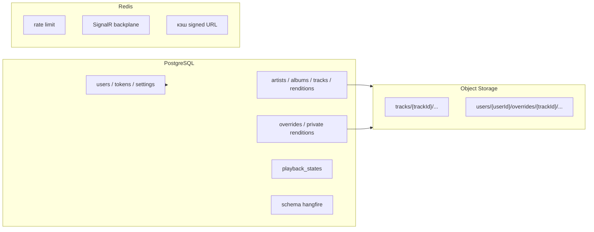
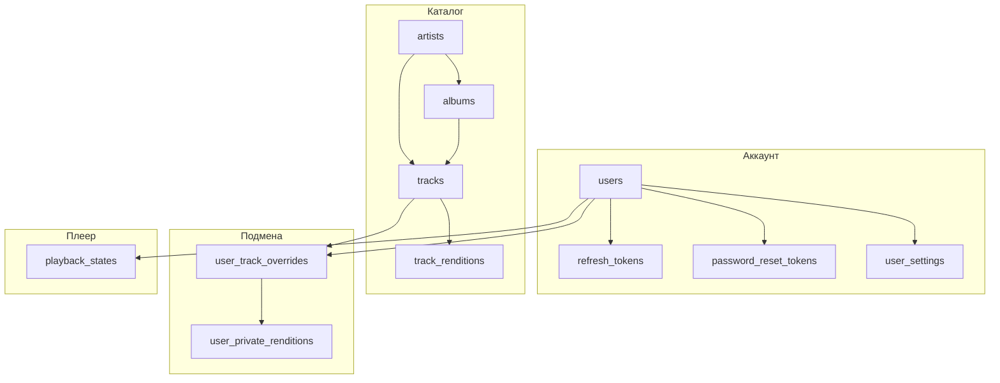
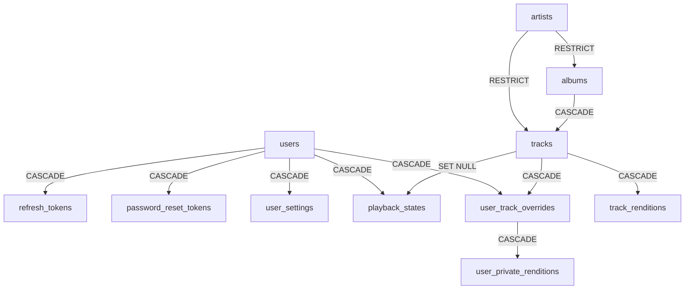

# Database overview

Версия: 1.0  
СУБД: **PostgreSQL 16**  
ORM: Entity Framework Core (миграции — единственный способ менять схему)  
Связанный документ: [01-product-plan.md](01-product-plan.md)

Аудиофайлы в PostgreSQL **не хранятся**. В таблицах только метаданные и ключи объектов в Yandex Object Storage.

---

## 1. Зачем этот документ

Зафиксировать целевую схему MVP так, чтобы по нему можно было написать EF-модели и миграции без догадок: таблицы, поля, типы, ключи, индексы, каскады, что **не** кладём в Postgres.

Имена таблиц и колонок — `snake_case`. В C# — PascalCase, маппинг через Npgsql snake_case naming или явные `[Column]`.

---

## 2. Что где лежит



| Данные | Где |
|---|---|
| Пользователи, пароли (хеш), роли | PostgreSQL `users` |
| Refresh / reset-токены | PostgreSQL |
| Каталог и качества каталога | PostgreSQL + объекты S3 `tracks/...` |
| Подмена и приватные рендиции | PostgreSQL + объекты S3 `users/{userId}/...` |
| Now playing, эфемерная очередь | PostgreSQL `playback_states` (снимок); realtime — SignalR/Redis |
| Локальный URI/bookmark файла | **только клиент**, не в БД |
| Signed URL | не персистить; Redis-кэш короче TTL подписи |
| Rate limit логина и reset | Redis |
| Джобы Hangfire | схема `hangfire` (создаёт библиотека, не EF) |
| ListenEvent, плейлисты, reco | **нет в MVP** — таблицы не создавать |

---

## 3. Соглашения

| Тема | Правило |
|---|---|
| PK | `uuid`, default `gen_random_uuid()` |
| Время | `timestamptz`, API пишет **UTC** |
| Мягкое удаление | нет в MVP; удаление — hard delete + каскад по таблице ниже |
| Enum в БД | `text` + `CHECK (...)`. Не PostgreSQL ENUM (больнее мигрировать в EF) |
| Деньги/секреты | пароль и токены — только хеш (`text`). Сырой JWT/пароль не писать |
| Email | всегда lowercase до insert/update |
| Login | уникальность **без учёта регистра** (`lower(login)`); формат `[a-zA-Z0-9_.-]{3,32}` проверяет API |
| Поиск | `pg_trgm`; индексы GIN на именах каталога |
| Аудио | `bucket_key` — ключ объекта, не URL и не байты |
| Чужой private | запросы всегда с `user_id = current`; для чужого — как будто строки нет |

Схемы:

- `public` — приложение (этот документ).
- `hangfire` — таблицы Hangfire, руками не описываем и в DbContext не включаем.

Расширения (включить первой миграцией):

```sql
CREATE EXTENSION IF NOT EXISTS pgcrypto;  -- gen_random_uuid
CREATE EXTENSION IF NOT EXISTS pg_trgm;   -- поиск
```

---

## 4. Диаграмма (ER)

```mermaid
erDiagram
  users ||--o{ refresh_tokens : "1:N"
  users ||--o{ password_reset_tokens : "1:N"
  users ||--|| user_settings : "1:1"
  users ||--o| playback_states : "1:1"
  users ||--o{ user_track_overrides : "1:N"
  users ||--o{ user_private_renditions : "1:N"

  artists ||--o{ albums : "1:N"
  artists ||--o{ tracks : "1:N"
  albums ||--o{ tracks : "1:N"
  tracks ||--o{ track_renditions : "1:N"

  tracks ||--o{ user_track_overrides : "1:N"
  tracks ||--o{ user_private_renditions : "1:N"
  user_track_overrides ||--o{ user_private_renditions : "1:N"

  users {
    uuid id PK
    text login "null unique ci"
    text email "null unique"
    text password_hash
    text role
    timestamptz created_at
    timestamptz updated_at
  }

  refresh_tokens {
    uuid id PK
    uuid user_id FK
    text token_hash UK
    uuid device_id
    timestamptz expires_at
    timestamptz revoked_at "null"
    timestamptz created_at
  }

  password_reset_tokens {
    uuid id PK
    uuid user_id FK
    text token_hash UK
    timestamptz expires_at
    timestamptz used_at "null"
    timestamptz created_at
  }

  user_settings {
    uuid user_id PK_FK
    text preferred_quality
    boolean prefer_local_if_available
    timestamptz updated_at
  }

  artists {
    uuid id PK
    text name
    text sort_name
    timestamptz created_at
  }

  albums {
    uuid id PK
    uuid artist_id FK
    text title
    int year "null"
    text cover_object_key "null"
    timestamptz created_at
  }

  tracks {
    uuid id PK
    uuid album_id FK
    uuid artist_id FK
    text title
    int track_number
    int duration_ms "null"
    text isrc "null"
    timestamptz created_at
    timestamptz updated_at
  }

  track_renditions {
    uuid id PK
    uuid track_id FK
    text profile_code
    text status
    text bucket_key "null"
    text content_type "null"
    int bitrate_kbps "null"
    bigint size_bytes "null"
    int duration_ms "null"
    text error_message "null"
    timestamptz created_at
    timestamptz updated_at
  }

  user_track_overrides {
    uuid user_id PK_FK
    uuid track_id PK_FK
    text preferred_source
    text display_name "null"
    int duration_ms "null"
    bigint size_bytes "null"
    boolean has_server_copy
    text upload_status
    timestamptz updated_at
  }

  user_private_renditions {
    uuid id PK
    uuid user_id FK
    uuid track_id FK
    text profile_code
    text status
    text bucket_key "null"
    text content_type "null"
    int bitrate_kbps "null"
    bigint size_bytes "null"
    int duration_ms "null"
    text error_message "null"
    timestamptz created_at
    timestamptz updated_at
  }

  playback_states {
    uuid user_id PK_FK
    uuid track_id FK "null"
    int position_ms
    boolean is_playing
    text quality_code "null"
    text source "null"
    uuid device_id "null"
    jsonb queue
    timestamptz updated_at
  }
```

Связь `user_private_renditions` с `user_track_overrides` — составной FK `(user_id, track_id)`. Рендиции не живут без строки override. Сначала создаётся override, потом upload/transcode.

---

## 5. Домены (логически)



---

## 6. Справочник допустимых значений

Хранятся как `text` + CHECK. Клиент не придумывает новые коды.

### 6.1. `users.role`

| Значение | Смысл |
|---|---|
| `user` | слушатель |
| `admin` | каталог, Hangfire dashboard, загрузка исходников каталога |

### 6.2. Профиль качества `profile_code`

Совпадает с FFmpeg-профилями. Одинаков для каталога и private.

| Значение | Кодек | Битрейт |
|---|---|---|
| `aac_128` | AAC в m4a | 128 kbps |
| `aac_256` | AAC в m4a | 256 kbps |
| `src` | как загружено | исходник; в выдачу клиенту — только если файл пригоден для стрима |

### 6.3. `user_settings.preferred_quality`

`auto` | `aac_128` | `aac_256` | `src`  
`auto` в API = максимальный `ready` по `bitrate_kbps`.

### 6.4. Статус рендиции `status`

`pending` → `processing` → `ready` | `failed`

Для `user_track_overrides.upload_status` те же значения плюс `none` (ещё не загружали на сервер).

### 6.5. Источник `preferred_source` / `playback_states.source`

| Значение | Что играет |
|---|---|
| `catalog` | signed URL каталожной рендиции |
| `local` | файл на устройстве (URI в БД нет) |
| `private` | signed URL `user_private_renditions` владельца |

### 6.6. `playback_states.queue` (jsonb)

```json
{
  "repeat": "off",
  "shuffle": false,
  "items": [
    { "trackId": "uuid", "source": "catalog" }
  ]
}
```

`repeat`: `off` | `one` | `all`.  
Пустая очередь: `{ "repeat": "off", "shuffle": false, "items": [] }`. Не `NULL`.

---

## 7. Таблицы

### 7.1. `users`

Одна строка — один аккаунт. При регистрации заполнено **ровно одно** из `login` / `email`. Позже второе можно привязать (оба NOT NULL). Нельзя оставить оба NULL.

| Колонка | Тип | Null | Описание |
|---|---|---|---|
| `id` | `uuid` | нет | PK |
| `login` | `text` | да | уникален среди не-null, сравнение `lower(login)` |
| `email` | `text` | да | lowercase, уникален среди не-null |
| `password_hash` | `text` | нет | ASP.NET `PasswordHasher` |
| `role` | `text` | нет | `user` / `admin`, default `user` |
| `created_at` | `timestamptz` | нет | |
| `updated_at` | `timestamptz` | нет | |

Ограничения:

```text
PK (id)
CHECK (login IS NOT NULL OR email IS NOT NULL)
CHECK (role IN ('user', 'admin'))
CHECK (login IS NULL OR login ~ '^[a-zA-Z0-9_.-]{3,32}$')
UNIQUE INDEX ux_users_email ON users (email) WHERE email IS NOT NULL
UNIQUE INDEX ux_users_login_lower ON users (lower(login)) WHERE login IS NOT NULL
```

Каскад: удаление пользователя удаляет токены, settings, overrides, private renditions, playback_state.

---

### 7.2. `refresh_tokens`

Хеш refresh-токена. Сырое значение — только клиенту, один раз.

| Колонка | Тип | Null | Описание |
|---|---|---|---|
| `id` | `uuid` | нет | PK |
| `user_id` | `uuid` | нет | FK → `users` ON DELETE CASCADE |
| `token_hash` | `text` | нет | UNIQUE |
| `device_id` | `uuid` | нет | UUID с клиента |
| `expires_at` | `timestamptz` | нет | |
| `revoked_at` | `timestamptz` | да | logout / logout-all / ротация |
| `created_at` | `timestamptz` | нет | |

Индексы: `(user_id)`, `(user_id, device_id)`.

Logout-all: `UPDATE ... SET revoked_at = now() WHERE user_id = :id AND revoked_at IS NULL`.

---

### 7.3. `password_reset_tokens`

Одноразовые токены письма. Forgot-password **не** сообщает, существует ли email.

| Колонка | Тип | Null | Описание |
|---|---|---|---|
| `id` | `uuid` | нет | PK |
| `user_id` | `uuid` | нет | FK → `users` ON DELETE CASCADE |
| `token_hash` | `text` | нет | UNIQUE |
| `expires_at` | `timestamptz` | нет | ориентир TTL 30 мин |
| `used_at` | `timestamptz` | да | |
| `created_at` | `timestamptz` | нет | |

Валидный reset: `used_at IS NULL AND expires_at > now()`. После успеха — `used_at = now()`, плюс revoke refresh-токенов по желанию (рекомендуется).

Hangfire только отправляет письмо; состояние — эта таблица.

---

### 7.4. `user_settings`

1:1 с пользователем. Строка создаётся вместе с `users` (тот же use-case регистрации).

| Колонка | Тип | Null | Default | Описание |
|---|---|---|---|---|
| `user_id` | `uuid` | нет | | PK, FK → `users` ON DELETE CASCADE |
| `preferred_quality` | `text` | нет | `auto` | `auto` / профили |
| `prefer_local_if_available` | `boolean` | нет | `true` | Local → Private → Catalog |
| `updated_at` | `timestamptz` | нет | | |

```text
CHECK (preferred_quality IN ('auto', 'aac_128', 'aac_256', 'src'))
```

---

### 7.5. `artists`

| Колонка | Тип | Null | Описание |
|---|---|---|---|
| `id` | `uuid` | нет | PK |
| `name` | `text` | нет | отображаемое имя |
| `sort_name` | `text` | нет | для сортировки; часто `lower(name)` |
| `created_at` | `timestamptz` | нет | |

Индексы: `GIN (name gin_trgm_ops)`, btree `(sort_name)`.  
Дубли имён в MVP разрешены (нет merge артистов).

---

### 7.6. `albums`

| Колонка | Тип | Null | Описание |
|---|---|---|---|
| `id` | `uuid` | нет | PK |
| `artist_id` | `uuid` | нет | FK → `artists` **ON DELETE RESTRICT** |
| `title` | `text` | нет | |
| `year` | `int` | да | |
| `cover_object_key` | `text` | да | ключ обложки в бакете, не URL |
| `created_at` | `timestamptz` | нет | |

Индексы: `(artist_id)`, `GIN (title gin_trgm_ops)`.

---

### 7.7. `tracks`

Карточка каталога. `duration_ms` заполняет транскод (ffprobe первой ready-рендиции), до этого NULL.

| Колонка | Тип | Null | Описание |
|---|---|---|---|
| `id` | `uuid` | нет | PK, стабильный id для override и плеера |
| `album_id` | `uuid` | нет | FK → `albums` ON DELETE CASCADE |
| `artist_id` | `uuid` | нет | FK → `artists` ON DELETE RESTRICT; может совпадать с альбомом |
| `title` | `text` | нет | |
| `track_number` | `int` | нет | порядок в альбоме, ≥ 1 |
| `duration_ms` | `int` | да | |
| `isrc` | `text` | да | под будущий импорт библиотек; в MVP пусто |
| `created_at` | `timestamptz` | нет | |
| `updated_at` | `timestamptz` | нет | |

```text
CHECK (track_number >= 1)
CHECK (duration_ms IS NULL OR duration_ms > 0)
UNIQUE INDEX ux_tracks_isrc ON tracks (isrc) WHERE isrc IS NOT NULL
INDEX ix_tracks_album_number ON tracks (album_id, track_number)
INDEX ix_tracks_artist ON tracks (artist_id)
GIN (title gin_trgm_ops)
```

Поиск **не** джойнит `user_private_renditions` и `user_track_overrides` других пользователей.

---

### 7.8. `track_renditions`

Только **каталог**. Один профиль — одна строка на трек.

| Колонка | Тип | Null | Описание |
|---|---|---|---|
| `id` | `uuid` | нет | PK |
| `track_id` | `uuid` | нет | FK → `tracks` ON DELETE CASCADE |
| `profile_code` | `text` | нет | `aac_128` / `aac_256` / `src` |
| `status` | `text` | нет | |
| `bucket_key` | `text` | да | например `tracks/{trackId}/aac_256.m4a`; NULL пока нет объекта |
| `content_type` | `text` | да | `audio/mp4` |
| `bitrate_kbps` | `int` | да | |
| `size_bytes` | `bigint` | да | |
| `duration_ms` | `int` | да | |
| `error_message` | `text` | да | без секретов S3 и без signed URL |
| `created_at` | `timestamptz` | нет | |
| `updated_at` | `timestamptz` | нет | |

```text
UNIQUE (track_id, profile_code)
CHECK (profile_code IN ('aac_128', 'aac_256', 'src'))
CHECK (status IN ('pending', 'processing', 'ready', 'failed'))
CHECK (status <> 'ready' OR bucket_key IS NOT NULL)
INDEX ix_track_renditions_ready ON track_renditions (track_id) WHERE status = 'ready'
```

Ключи только префикс `tracks/{trackId}/...`. Пользовательские файлы сюда не писать.

Клиенту в `availableQualities` отдавать строки со `status = 'ready'`.

---

### 7.9. `user_track_overrides`

Персональная подмена каталожного трека. Локальный URI **не хранится**.

| Колонка | Тип | Null | Default | Описание |
|---|---|---|---|---|
| `user_id` | `uuid` | нет | | PK, FK → `users` CASCADE |
| `track_id` | `uuid` | нет | | PK, FK → `tracks` CASCADE |
| `preferred_source` | `text` | нет | `local` | `catalog` / `local` / `private` |
| `display_name` | `text` | да | | имя файла для UI |
| `duration_ms` | `int` | да | | длительность локального/загруженного |
| `size_bytes` | `bigint` | да | | исходник |
| `has_server_copy` | `boolean` | нет | `false` | есть ли объекты private |
| `upload_status` | `text` | нет | `none` | |
| `updated_at` | `timestamptz` | нет | | |

```text
PRIMARY KEY (user_id, track_id)
CHECK (preferred_source IN ('catalog', 'local', 'private'))
CHECK (upload_status IN ('none', 'pending', 'processing', 'ready', 'failed'))
CHECK (preferred_source <> 'private' OR has_server_copy = true)
INDEX ix_overrides_user ON user_track_overrides (user_id)
```

Инвариант: `has_server_copy = true` ⇔ существует хотя бы одна `user_private_renditions` (лучше поддерживать в коде джобы, не триггером, если нет нужды).

Удаление override с `deleteServerCopy=true`: сначала объекты S3, потом `user_private_renditions`, потом строка override (или CASCADE с рендиций).

---

### 7.10. `user_private_renditions`

Приватные качества **владельца**. Чужой `user_id` не должен уметь прочитать строку (фильтр в запросе; для API — 404).

| Колонка | Тип | Null | Описание |
|---|---|---|---|
| `id` | `uuid` | нет | PK |
| `user_id` | `uuid` | нет | часть FK на override |
| `track_id` | `uuid` | нет | часть FK на override |
| `profile_code` | `text` | нет | |
| `status` | `text` | нет | |
| `bucket_key` | `text` | да | **только** `users/{userId}/overrides/{trackId}/...` |
| `content_type` | `text` | да | |
| `bitrate_kbps` | `int` | да | |
| `size_bytes` | `bigint` | да | |
| `duration_ms` | `int` | да | |
| `error_message` | `text` | да | |
| `created_at` | `timestamptz` | нет | |
| `updated_at` | `timestamptz` | нет | |

```text
UNIQUE (user_id, track_id, profile_code)
FOREIGN KEY (user_id, track_id)
  REFERENCES user_track_overrides (user_id, track_id) ON DELETE CASCADE
CHECK (profile_code IN ('aac_128', 'aac_256', 'src'))
CHECK (status IN ('pending', 'processing', 'ready', 'failed'))
CHECK (status <> 'ready' OR bucket_key IS NOT NULL)
INDEX ix_private_renditions_user ON user_private_renditions (user_id)
INDEX ix_private_renditions_ready
  ON user_private_renditions (user_id, track_id) WHERE status = 'ready'
```

Каталожный поиск / `GET /api/tracks/{id}` эти строки **не** включают.

Админ-каталог их не показывает. Hangfire знает `user_id` из аргумента джобы, не из «всех рендиций мира».

---

### 7.11. `playback_states`

Один снимок на пользователя (не на устройство). Last-write-wins по `updated_at`. Кто сейчас «ведёт» звук — `device_id`.

| Колонка | Тип | Null | Описание |
|---|---|---|---|
| `user_id` | `uuid` | нет | PK, FK → `users` CASCADE |
| `track_id` | `uuid` | да | FK → `tracks` ON DELETE SET NULL; пустой плеер |
| `position_ms` | `int` | нет | default 0, ≥ 0 |
| `is_playing` | `boolean` | нет | |
| `quality_code` | `text` | да | `auto` или профиль |
| `source` | `text` | да | `catalog` / `local` / `private` |
| `device_id` | `uuid` | да | кто отправил последний state |
| `queue` | `jsonb` | нет | см. §6.6 |
| `updated_at` | `timestamptz` | нет | |

```text
CHECK (position_ms >= 0)
CHECK (source IS NULL OR source IN ('catalog', 'local', 'private'))
CHECK (jsonb_typeof(queue) = 'object')
```

Presence устройств в Postgres не дублируем: онлайн — SignalR + Redis.

---

## 8. Каскады (сводка)



Удалить артиста, пока на него ссылаются альбомы/треки — нельзя. Сначала контент.

Удалить альбом — уходят его треки, каталожные рендиции и **все** override всех пользователей на эти треки (включая private-метаданные). Объекты S3 джоба должна подчистить отдельно (ключи предсказуемые по id).

---

## 9. Ключи в Object Storage (не колонки, но контракт)

| Вид | Шаблон `bucket_key` |
|---|---|
| Исходник каталога | `tracks/{trackId}/src/{originalFileName}` |
| Каталог AAC | `tracks/{trackId}/aac_128.m4a`, `.../aac_256.m4a` |
| Обложка | `catalog/covers/{albumId}` |
| Исходник private | `users/{userId}/overrides/{trackId}/src/{originalFileName}` |
| Private AAC | `users/{userId}/overrides/{trackId}/aac_256.m4a` |

Проверка в коде джобы: каталожный job не пишет `users/`, private job не пишет `tracks/`.

---

## 10. Индексы — полный список

| Имя | Таблица | Определение |
|---|---|---|
| `pk_*` | все | PK как выше |
| `ux_users_email` | `users` | `(email) WHERE email IS NOT NULL` |
| `ux_users_login_lower` | `users` | `(lower(login)) WHERE login IS NOT NULL` |
| `ix_refresh_tokens_user` | `refresh_tokens` | `(user_id)` |
| `ux_refresh_tokens_hash` | `refresh_tokens` | `(token_hash)` |
| `ux_password_reset_hash` | `password_reset_tokens` | `(token_hash)` |
| `ix_password_reset_user` | `password_reset_tokens` | `(user_id)` |
| `ix_albums_artist` | `albums` | `(artist_id)` |
| `gin_artists_name` | `artists` | `USING gin (name gin_trgm_ops)` |
| `gin_albums_title` | `albums` | `USING gin (title gin_trgm_ops)` |
| `gin_tracks_title` | `tracks` | `USING gin (title gin_trgm_ops)` |
| `ix_tracks_album_number` | `tracks` | `(album_id, track_number)` |
| `ix_tracks_artist` | `tracks` | `(artist_id)` |
| `ux_tracks_isrc` | `tracks` | `(isrc) WHERE isrc IS NOT NULL` |
| `ux_track_renditions_profile` | `track_renditions` | `(track_id, profile_code)` |
| `ix_track_renditions_ready` | `track_renditions` | `(track_id) WHERE status = 'ready'` |
| `pk_overrides` | `user_track_overrides` | `(user_id, track_id)` |
| `ux_private_renditions_profile` | `user_private_renditions` | `(user_id, track_id, profile_code)` |
| `ix_private_renditions_ready` | `user_private_renditions` | `(user_id, track_id) WHERE status = 'ready'` |

Поиск:

```sql
SELECT id FROM tracks
WHERE title ILIKE '%' || :q || '%'
LIMIT 20;
-- при pg_trgm:
-- WHERE title % :q  OR title ILIKE ...
```

Никогда:

```sql
-- запрещено в публичном поиске
SELECT ... FROM user_private_renditions WHERE display/name ILIKE ...
```

---

## 11. Типовые запросы доступа

Каталожные качества для плеера:

```sql
SELECT profile_code, bitrate_kbps, bucket_key
FROM track_renditions
WHERE track_id = :trackId AND status = 'ready';
```

Private качества **только владельца**:

```sql
SELECT profile_code, bitrate_kbps, bucket_key
FROM user_private_renditions
WHERE user_id = :currentUserId
  AND track_id = :trackId
  AND status = 'ready';
```

Чужой user: 0 строк → API 404, не 403.

Override для карточки:

```sql
SELECT *
FROM user_track_overrides
WHERE user_id = :currentUserId AND track_id = :trackId;
```

---

## 12. Seed (Development)

Минимум для демо (конкретные UUID — на усмотрение миграции/HasData):

- 1× `users`: `role = admin`, идентификатор из env.
- 1× `user_settings` для него.
- 2–3 `artists`, несколько `albums`, ~10 `tracks`.
- Рендиции seed-треков появятся в спринте хранилища; в спринте каталога `track_renditions` может быть пустым.

Пароль admin — только хеш. Сырой пароль — README локалки, не таблица.

---

## 13. Hangfire

Схема `hangfire`, таблицы создаёт `Hangfire.PostgreSql`. В обзор приложения не входят. Не делать FK из `public` в `hangfire`. Идентификаторы джоб (`trackId`, `userId`) — аргументы джобы, состояние файлов — `track_renditions` / `user_private_renditions`.

---

## 14. Чего нет в MVP (не создавать)

| Таблица | Когда понадобится |
|---|---|
| `listen_events` | рекомендации |
| `track_popularity`, `track_similar` | рекомендации |
| `playlists`, `playlist_tracks` | плейлисты / избранное |
| `liked_tracks` | избранное |
| `oauth_accounts` | Яндекс OAuth |
| `devices` | если presence переедет из Redis |
| `album_artists` M:N | сборники сложнее текущего `tracks.artist_id` |

Имена зарезервированы: не занимать их для другого смысла.

---

## 15. EF Core (заметки к реализации)

- `HasCheckConstraint` для всех CHECK из этого файла.
- Filtered unique: `HasIndex(e => e.Email).IsUnique().HasFilter("email IS NOT NULL")`; для login — computed/`HasFilter` на `lower(login)` через raw SQL в миграции, если провайдер не выразит `lower()`.
- `PlaybackState.Queue` — `jsonb`, `OwnsOne` не обязателен; `jsonb` + сериализация DTO.
- Не включать Hangfire entity.
- `OnDelete` как в §8.
- `UserPrivateRendition` и `UserTrackOverride`: составной FK, `HasPrincipalKey`.

Строка `user_settings` и опционально пустой `playback_states` — в том же транзакционном `SaveChanges`, что и `users` при register.

---

## 16. Целевой DDL (ориентир)

Ниже — целевое состояние, не копировать вместо миграций EF. Для ревью и DBA.

```sql
CREATE EXTENSION IF NOT EXISTS pgcrypto;
CREATE EXTENSION IF NOT EXISTS pg_trgm;

CREATE TABLE users (
    id              uuid PRIMARY KEY DEFAULT gen_random_uuid(),
    login           text NULL,
    email           text NULL,
    password_hash   text NOT NULL,
    role            text NOT NULL DEFAULT 'user',
    created_at      timestamptz NOT NULL DEFAULT now(),
    updated_at      timestamptz NOT NULL DEFAULT now(),
    CONSTRAINT ck_users_identifier CHECK (login IS NOT NULL OR email IS NOT NULL),
    CONSTRAINT ck_users_role CHECK (role IN ('user', 'admin')),
    CONSTRAINT ck_users_login_format CHECK (
        login IS NULL OR login ~ '^[a-zA-Z0-9_.-]{3,32}$'
    )
);
CREATE UNIQUE INDEX ux_users_email ON users (email) WHERE email IS NOT NULL;
CREATE UNIQUE INDEX ux_users_login_lower ON users (lower(login)) WHERE login IS NOT NULL;

CREATE TABLE refresh_tokens (
    id           uuid PRIMARY KEY DEFAULT gen_random_uuid(),
    user_id      uuid NOT NULL REFERENCES users (id) ON DELETE CASCADE,
    token_hash   text NOT NULL UNIQUE,
    device_id    uuid NOT NULL,
    expires_at   timestamptz NOT NULL,
    revoked_at   timestamptz NULL,
    created_at   timestamptz NOT NULL DEFAULT now()
);
CREATE INDEX ix_refresh_tokens_user ON refresh_tokens (user_id);

CREATE TABLE password_reset_tokens (
    id           uuid PRIMARY KEY DEFAULT gen_random_uuid(),
    user_id      uuid NOT NULL REFERENCES users (id) ON DELETE CASCADE,
    token_hash   text NOT NULL UNIQUE,
    expires_at   timestamptz NOT NULL,
    used_at      timestamptz NULL,
    created_at   timestamptz NOT NULL DEFAULT now()
);
CREATE INDEX ix_password_reset_user ON password_reset_tokens (user_id);

CREATE TABLE user_settings (
    user_id                    uuid PRIMARY KEY REFERENCES users (id) ON DELETE CASCADE,
    preferred_quality          text NOT NULL DEFAULT 'auto',
    prefer_local_if_available  boolean NOT NULL DEFAULT true,
    updated_at                 timestamptz NOT NULL DEFAULT now(),
    CONSTRAINT ck_settings_quality CHECK (
        preferred_quality IN ('auto', 'aac_128', 'aac_256', 'src')
    )
);

CREATE TABLE artists (
    id          uuid PRIMARY KEY DEFAULT gen_random_uuid(),
    name        text NOT NULL,
    sort_name   text NOT NULL,
    created_at  timestamptz NOT NULL DEFAULT now()
);
CREATE INDEX gin_artists_name ON artists USING gin (name gin_trgm_ops);

CREATE TABLE albums (
    id                 uuid PRIMARY KEY DEFAULT gen_random_uuid(),
    artist_id          uuid NOT NULL REFERENCES artists (id) ON DELETE RESTRICT,
    title              text NOT NULL,
    year               int NULL,
    cover_object_key   text NULL,
    created_at         timestamptz NOT NULL DEFAULT now()
);
CREATE INDEX ix_albums_artist ON albums (artist_id);
CREATE INDEX gin_albums_title ON albums USING gin (title gin_trgm_ops);

CREATE TABLE tracks (
    id            uuid PRIMARY KEY DEFAULT gen_random_uuid(),
    album_id      uuid NOT NULL REFERENCES albums (id) ON DELETE CASCADE,
    artist_id     uuid NOT NULL REFERENCES artists (id) ON DELETE RESTRICT,
    title         text NOT NULL,
    track_number  int NOT NULL,
    duration_ms   int NULL,
    isrc          text NULL,
    created_at    timestamptz NOT NULL DEFAULT now(),
    updated_at    timestamptz NOT NULL DEFAULT now(),
    CONSTRAINT ck_tracks_number CHECK (track_number >= 1),
    CONSTRAINT ck_tracks_duration CHECK (duration_ms IS NULL OR duration_ms > 0)
);
CREATE INDEX ix_tracks_album_number ON tracks (album_id, track_number);
CREATE INDEX ix_tracks_artist ON tracks (artist_id);
CREATE UNIQUE INDEX ux_tracks_isrc ON tracks (isrc) WHERE isrc IS NOT NULL;
CREATE INDEX gin_tracks_title ON tracks USING gin (title gin_trgm_ops);

CREATE TABLE track_renditions (
    id             uuid PRIMARY KEY DEFAULT gen_random_uuid(),
    track_id       uuid NOT NULL REFERENCES tracks (id) ON DELETE CASCADE,
    profile_code   text NOT NULL,
    status         text NOT NULL,
    bucket_key     text NULL,
    content_type   text NULL,
    bitrate_kbps   int NULL,
    size_bytes     bigint NULL,
    duration_ms    int NULL,
    error_message  text NULL,
    created_at     timestamptz NOT NULL DEFAULT now(),
    updated_at     timestamptz NOT NULL DEFAULT now(),
    CONSTRAINT ux_track_renditions_profile UNIQUE (track_id, profile_code),
    CONSTRAINT ck_tr_profile CHECK (profile_code IN ('aac_128', 'aac_256', 'src')),
    CONSTRAINT ck_tr_status CHECK (status IN ('pending', 'processing', 'ready', 'failed')),
    CONSTRAINT ck_tr_ready_key CHECK (status <> 'ready' OR bucket_key IS NOT NULL)
);
CREATE INDEX ix_track_renditions_ready ON track_renditions (track_id) WHERE status = 'ready';

CREATE TABLE user_track_overrides (
    user_id           uuid NOT NULL REFERENCES users (id) ON DELETE CASCADE,
    track_id          uuid NOT NULL REFERENCES tracks (id) ON DELETE CASCADE,
    preferred_source  text NOT NULL DEFAULT 'local',
    display_name      text NULL,
    duration_ms       int NULL,
    size_bytes        bigint NULL,
    has_server_copy   boolean NOT NULL DEFAULT false,
    upload_status     text NOT NULL DEFAULT 'none',
    updated_at        timestamptz NOT NULL DEFAULT now(),
    PRIMARY KEY (user_id, track_id),
    CONSTRAINT ck_uto_source CHECK (preferred_source IN ('catalog', 'local', 'private')),
    CONSTRAINT ck_uto_upload CHECK (
        upload_status IN ('none', 'pending', 'processing', 'ready', 'failed')
    ),
    CONSTRAINT ck_uto_private CHECK (preferred_source <> 'private' OR has_server_copy = true)
);

CREATE TABLE user_private_renditions (
    id             uuid PRIMARY KEY DEFAULT gen_random_uuid(),
    user_id        uuid NOT NULL,
    track_id       uuid NOT NULL,
    profile_code   text NOT NULL,
    status         text NOT NULL,
    bucket_key     text NULL,
    content_type   text NULL,
    bitrate_kbps   int NULL,
    size_bytes     bigint NULL,
    duration_ms    int NULL,
    error_message  text NULL,
    created_at     timestamptz NOT NULL DEFAULT now(),
    updated_at     timestamptz NOT NULL DEFAULT now(),
    CONSTRAINT ux_upr_profile UNIQUE (user_id, track_id, profile_code),
    CONSTRAINT fk_upr_override FOREIGN KEY (user_id, track_id)
        REFERENCES user_track_overrides (user_id, track_id) ON DELETE CASCADE,
    CONSTRAINT ck_upr_profile CHECK (profile_code IN ('aac_128', 'aac_256', 'src')),
    CONSTRAINT ck_upr_status CHECK (status IN ('pending', 'processing', 'ready', 'failed')),
    CONSTRAINT ck_upr_ready_key CHECK (status <> 'ready' OR bucket_key IS NOT NULL)
);
CREATE INDEX ix_private_renditions_user ON user_private_renditions (user_id);
CREATE INDEX ix_private_renditions_ready
    ON user_private_renditions (user_id, track_id) WHERE status = 'ready';

CREATE TABLE playback_states (
    user_id        uuid PRIMARY KEY REFERENCES users (id) ON DELETE CASCADE,
    track_id       uuid NULL REFERENCES tracks (id) ON DELETE SET NULL,
    position_ms    int NOT NULL DEFAULT 0,
    is_playing     boolean NOT NULL DEFAULT false,
    quality_code   text NULL,
    source         text NULL,
    device_id      uuid NULL,
    queue          jsonb NOT NULL DEFAULT '{"repeat":"off","shuffle":false,"items":[]}'::jsonb,
    updated_at     timestamptz NOT NULL DEFAULT now(),
    CONSTRAINT ck_ps_pos CHECK (position_ms >= 0),
    CONSTRAINT ck_ps_source CHECK (source IS NULL OR source IN ('catalog', 'local', 'private')),
    CONSTRAINT ck_ps_queue CHECK (jsonb_typeof(queue) = 'object')
);
```

---

## 17. Соответствие спринтам

| Спринт | Появляются таблицы |
|---|---|
| 01 Auth | `users`, `refresh_tokens`, `password_reset_tokens`, `user_settings` (settings можно сразу 1:1) |
| 02 Catalog | `artists`, `albums`, `tracks` |
| 03 Storage | `track_renditions` |
| 04 Player | `playback_states` (если не создали раньше пустыми) |
| 05 Override | `user_track_overrides`, `user_private_renditions` |
| 06 SignalR | новых таблиц нет; пишется `playback_states` |
| Hangfire | схема `hangfire` с спринта 01 |

Миграции наращивать по спринтам, не одной «божественной» схемой в день 1 — но **имена и смысл полей** из этого файла не менять без правки документа.
